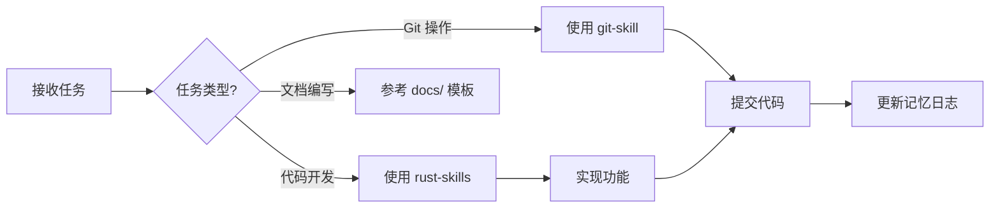

# AGENTS.md - zzm (zig-zls-manager) 工作手册

> ⚠️ **本文件遵循 Hermes Agent 配置规范生成**
> 每次会话启动时必须首先阅读此文件，按流程执行
> **不要询问权限，直接按顺序执行**

***

## 项目概览

| 属性      | 值                                   |
| ------- | ----------------------------------- |
| **名称**  | zzm (zig-zls-manager)               |
| **类型**  | Rust CLI 工具                         |
| **功能**  | Zig/ZLS 联合版本管理器                     |
| **技术栈** | Rust 2024, clap, tokio, reqwest     |
| **架构**  | 分层架构（CLI → Core → Infra → Platform） |

### 快速定位文档

| 需求     | 文档位置                                             |
| ------ | ------------------------------------------------ |
| 需求与规格  | [docs/spec.md](./docs/spec.md)                   |
| 架构设计   | [docs/architecture.md](./docs/architecture.md)   |
| 使用指南   | [docs/usage.md](./docs/usage.md)                 |
| API 参考 | [docs/api-reference.md](./docs/api-reference.md) |
| 竞品分析   | [docs/comparison.md](./docs/comparison.md)       |

***

## Every Session 完整生命周期

### Phase 1: 会话启动（必须按顺序）

```
┌─────────────────────────────────────────────────────────────┐
│  Step 1: 加载身份                                           │
│  → 读取 SOUL.md                                            │
│  → 确认：我是谁、沟通风格、价值观                           │
├─────────────────────────────────────────────────────────────┤
│  Step 2: 加载用户画像                                       │
│  → 读取 USER.md                                            │
│  → 确认：用户偏好、沟通习惯、工作方式                       │
├─────────────────────────────────────────────────────────────┤
│  Step 3: 恢复记忆上下文                                     │
│  → 读取 memory/YYYY-MM-DD.md（今天 + 昨天）                 │
│  → 读取 MEMORY.md（记忆索引）                               │
│  → 如有 projects.md / lessons.md / infra.md 则一并读取      │
├─────────────────────────────────────────────────────────────┤
│  Step 4: 确认项目状态                                       │
│  → 检查 Cargo.toml 依赖                                    │
│  → 查看 docs/TODO.md 待办事项                              │
│  → 查看 docs/ROADMAP.md 路线图                             │
└─────────────────────────────────────────────────────────────┘
```

### Phase 2: 会话工作中（持续进行）

#### 记忆写入决策树

```
发生了一件事，要不要记录？
        │
        ▼
   值得记住吗？
    │
    ├── 太琐碎 → 忽略
    │
    └── 值得 ↓
            │
            ▼
       信息类型判断
            │
    ├── 用户偏好变更          → 写入 USER.md
    │   （通过 memory tool）
    │
    ├── 项目进展/状态变化     → 写入 memory/projects.md
    │
    ├── 踩坑/错误/重要发现    → 写入 memory/lessons.md
    │
    ├── 今天做了什么/决策     → 写入 memory/YYYY-MM-DD.md
    │
    └── 环境/基础设施事实     → 写入 MEMORY.md 或 memory/infra.md
```

#### 日志条目格式规范（memory/YYYY-MM-DD.md）

```markdown
## HH:MM - [TYPE]: [简短标题]

- 做了什么（动词开头）
- 关键决策及原因
- 结果或交付物

**Lesson**: 学到了什么（可选）
**TODO**: 后续步骤（可选）
```

**类型分类**：

| 类型              | 用途   | 示例           |
| --------------- | ---- | ------------ |
| `Session Start` | 会话启动 | 记录读取了哪些配置文件  |
| `Task`          | 主要任务 | 实现功能、编写文档、设计 |
| `Interruption`  | 突发中断 | 紧急 Bug、临时请求  |
| `Decision`      | 重要决策 | 技术选型、架构决策    |

#### 教训记录格式（memory/lessons.md）

```markdown
### [severity] - [标题]
- **Date**: YYYY-MM-DD
- **Impact**: 造成的影响
- **Solution**: 正确做法
- **Tags**: tag1, tag2
```

**严重程度分级**：

| 级别          | 含义    | 行为规则      |
| ----------- | ----- | --------- |
| 🔴 CRITICAL | 绝不能再犯 | 行动前必须主动检查 |
| 🟡 WARNING  | 需要小心  | 遇到相关技术时提醒 |
| 🟢 TIPS     | 最佳实践  | 作为建议性提示   |

### Phase 3: 会话结束（收尾必做）

```
┌─────────────────────────────────────────────────────────────┐
│  End-of-Session Checklist                                   │
├─────────────────────────────────────────────────────────────┤
│                                                              │
│  □ 更新今日日志                                              │
│    → 追加本次会话完成的工作到 memory/YYYY-MM-DD.md           │
│    → 格式：总结已完成项、待续项、学到的教训                  │
│                                                              │
│  □ 同步项目状态                                              │
│    → 如有项目进展，更新 memory/projects.md                   │
│                                                              │
│  □ 提取教训                                                  │
│    → 如踩坑或有重要发现，写入 memory/lessons.md              │
│                                                              │
│  □ 更新记忆索引                                              │
│    → 如有重大变更，同步更新 MEMORY.md                        │
│                                                              │
│  □ 文档联动更新（如有）                                      │
│    → 新功能 → docs/usage.md                                 │
│    → API 变更 → docs/api-reference.md                       │
│    → 架构调整 → docs/architecture.md                         │
│                                                              │
└─────────────────────────────────────────────────────────────┘
```

**收尾日志模板**：

```markdown
## HH:MM - End of Session Wrap-up

### Completed Today ✅
- [x] 完成的工作 1
- [x] 完成的工作 2

### Deferred to Tomorrow 📅
- [ ] 未完成的任务 1
- [ ] 未完成的任务 2
```

***

## 五层记忆架构指引

```
Layer 1: MEMORY.md         ← 记忆索引（<40行，每周整理）
Layer 2: memory/projects.md ← 项目状态追踪（有进展时更新）
Layer 3: memory/infra.md   ← 基础设施速查（变更时更新）
Layer 4: memory/lessons.md ← 教训库（踩坑时立即写入）
Layer 5: memory/YYYY-MM-DD.md ← 每日日志（持续追加）
```

| 层级           | 写入时机       | 维护频率 |
| ------------ | ---------- | ---- |
| L1 Index     | 有重大环境/事实变更 | 每周整理 |
| L2 Projects  | 项目有进展      | 实时更新 |
| L3 Infra     | 基础设施变更     | 按需更新 |
| L4 Lessons   | 踩坑/发现时     | 实时写入 |
| L5 Daily Log | 工作过程中      | 持续追加 |

***

## 开发工作流

### 任务处理流程



### 常用命令速查

| 操作   | 命令                      | 说明     |
| ---- | ----------------------- | ------ |
| 构建   | `cargo build`           | 编译项目   |
| 运行   | `cargo run -- <args>`   | 执行 CLI |
| 测试   | `cargo test`            | 运行测试   |
| 检查   | `cargo check`           | 快速类型检查 |
| 格式化  | `cargo fmt`             | 代码格式化  |
| Lint | `cargo clippy`          | 静态分析   |
| 发布构建 | `cargo build --release` | 优化编译   |

***

## Skill 使用指南

| 场景           | Skill                 | 触发条件                    |
| ------------ | --------------------- | ----------------------- |
| Git 提交/分支/PR | `git-skill`           | 涉及 git 操作时自动调用          |
| Rust 代码编写    | `rust-skills`         | 涉及 Rust 代码时自动调用         |
| 配置/记忆管理      | `hermes-agent-config` | 涉及 SOUL/USER/MEMORY 时调用 |
| 项目/仓库分析      | `repo-analyzer`       | 分析架构、源码研究、竞品对比时调用       |

### repo-analyzer 使用要点

**触发关键词**：`分析项目`、`架构分析`、`源码分析`、`研究这个框架`

**适用场景**（仅限本项目）：

- 深入理解 zzm 项目的架构设计和模块职责
- 研究 Zig/ZLS 管理器的实现思路和技术选型
- 生成项目架构分析报告

**输出产物**：在项目内 `docs/analyses/` 下生成完整分析报告（含 Mermaid 架构图）

**不适用场景**：单文件调试、简单代码审查、非架构层面的修改

***

## 项目结构指引

```
zzm/
├── src/
│   ├── main.rs          # 入口点
│   ├── cli.rs           # CLI 命令定义
│   ├── core/            # 业务逻辑层
│   ├── infra/           # 基础设施层
│   ├── platform/        # 平台抽象层
│   ├── output/          # 输出格式化
│   └── utils/           # 工具函数
├── docs/                # 项目文档中心
├── memory/              # 分层记忆存储
├── SOUL.md              # Agent 身份定义
├── USER.md              # 用户偏好档案
└── MEMORY.md            # 长期记忆索引
```

详细架构说明见 [docs/architecture.md](./docs/architecture.md)

***

## 关键约定

### 代码规范

- Rust 2024 edition
- 错误处理：`anyhow`
- 日志：`tracing`
- 异步：`tokio`

### Git 提交（必须使用 git-skill）

1. Conventional Commits 规范
2. 提交前：`cargo clippy` + `cargo test`

### 文档联动规则

- 新功能 → [usage.md](./docs/usage.md)
- API 变更 → [api-reference.md](./docs/api-reference.md)
- 架构调整 → [architecture.md](./docs/architecture.md)

***

## 故障排除

| 问题     | 解决方案                                           |
| ------ | ---------------------------------------------- |
| 编译失败   | `cargo update` 后重试                             |
| 测试失败   | `cargo test -- --nocapture` 查看详情               |
| 平台兼容   | 检查 `src/platform/` 对应实现                        |
| API 变更 | 查看 [api-reference.md](./docs/api-reference.md) |

***

## 项目范围约束（强制）

> ⛔ **所有操作必须限定在当前项目目录内**

```
项目根目录: d:\Workplace\APP\Rust\zig-zls-manager
```

### 文件操作边界

| 操作类型 | 允许范围 | 禁止行为 |
|---------|---------|---------|
| 读写文件 | 项目内所有路径 | 写入 `~/`、`/tmp/`、系统目录 |
| 生成报告 | `docs/analyses/` | `~/repo-analyses/` 或外部路径 |
| 记忆存储 | `memory/`、`MEMORY.md`、`USER.md` | 外部记忆文件 |
| 依赖安装 | 项目内 `cargo install` | 全局安装系统包 |
| Git 操作 | 当前仓库 | 克隆外部仓库到项目外 |

### Skill 调用约束

- **repo-analyzer**: 仅分析本项目，报告输出到 `docs/analyses/`
- **git-skill**: 仅操作当前仓库
- **rust-skills**: 仅修改本项目代码
- **hermes-agent-config**: 配置文件仅限项目内的 SOUL.md / USER.md / MEMORY.md

### 越界处理

如遇到需要访问项目外资源的场景：
1. 先向用户说明需要什么、为什么需要
2. 等待用户明确授权后再执行
3. 将结果复制回项目内存储

---

## ⚠️ 注意事项

- 修改 `core/` 前务必阅读 [architecture.md](./docs/architecture.md)
- 新平台支持需实现 `platform/trait_def.rs` 的 trait
- 下载功能需考虑网络异常和断点续传
- **Memory 有字符限制**，只保存高价值信息，定期清理过时内容

