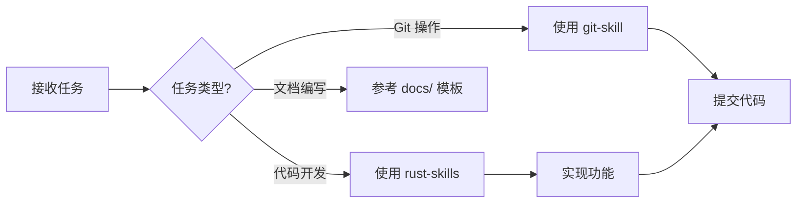

# AGENTS.md - zzm (zig-zls-manager) 工作手册

> ⚠️ **本文件遵循 Hermes Agent 配置规范生成**
> 每次会话启动时必须首先阅读此文件，按流程执行

---

## 项目概览

| 属性 | 值 |
|------|-----|
| **名称** | zzm (zig-zls-manager) |
| **类型** | Rust CLI 工具 |
| **功能** | Zig/ZLS 联合版本管理器 |
| **技术栈** | Rust 2024, clap, tokio, reqwest |
| **架构** | 分层架构（CLI → Core → Infra → Platform） |

### 快速定位文档

| 需求 | 文档位置 |
|------|----------|
| 需求与规格 | [docs/spec.md](./docs/spec.md) |
| 架构设计 | [docs/architecture.md](./docs/architecture.md) |
| 使用指南 | [docs/usage.md](./docs/usage.md) |
| API 参考 | [docs/api-reference.md](./docs/api-reference.md) |
| 竞品分析 | [docs/comparison.md](./docs/comparison.md) |

---

## Every Session 启动流程（必须按顺序）

### Step 1: 加载身份配置
```
读取 SOUL.md → 理解当前 Agent 身份和沟通风格
```

### Step 2: 加载用户上下文
```
读取 USER.md → 了解当前用户偏好和需求
```

### Step 3: 恢复记忆上下文
```
读取 memory/YYYY-MM-DD.md → 获取最近的工作上下文
读取 MEMORY.md → 了解长期记忆要点
```

### Step 4: 确认项目状态
```
检查 Cargo.toml → 确认依赖和配置
查看 docs/TODO.md → 了解待办事项
查看 docs/ROADMAP.md → 了解路线图
```

---

## 开发工作流

### 日常开发流程



### 常用命令速查

| 操作 | 命令 | 说明 |
|------|------|------|
| 构建 | `cargo build` | 编译项目 |
| 运行 | `cargo run -- <args>` | 执行 CLI |
| 测试 | `cargo test` | 运行测试 |
| 检查 | `cargo check` | 快速类型检查 |
| 格式化 | `cargo fmt` | 代码格式化 |
| Lint | `cargo clippy` | 静态分析 |
| 发布构建 | `cargo build --release` | 优化编译 |

---

## Skill 使用指南

### Git 相关操作 → 使用 `git-skill`
- 提交代码、创建分支、合并 PR
- 查看提交历史、解决冲突
- **调用方式**: 自动识别 git 操作时触发

### Rust 开发相关 → 使用 `rust-skills`
- 编写新模块、重构代码
- 处理所有权、生命周期、异步编程
- **子技能覆盖**: ownership, async, error-handling, testing 等
- **调用方式**: 涉及 Rust 代码编写时触发

### Hermes Agent 配置 → 使用 `hermes-agent-config`
- 更新 SOUL.md / USER.md / MEMORY.md
- 管理记忆系统、上下文文件
- **调用方式**: 涉及配置或记忆管理时触发

---

## 项目结构指引

```
zzm/
├── src/
│   ├── main.rs          # 入口点
│   ├── cli.rs           # CLI 命令定义
│   ├── core/            # 业务逻辑层
│   │   ├── config.rs    # 配置管理
│   │   ├── zig_manager.rs   # Zig 版本管理
│   │   └── zls_manager.rs   # ZLS 版本管理
│   ├── infra/           # 基础设施层
│   │   ├── downloader.rs    # 下载器
│   │   ├── zig_api.rs       # Zig API 封装
│   │   └── zls_api.rs       # ZLS API 封装
│   ├── platform/        # 平台抽象层
│   │   ├── windows.rs   # Windows 实现
│   │   ├── linux.rs     # Linux 实现
│   │   └── macos.rs     # macOS 实现
│   ├── output/          # 输出格式化
│   └── utils/           # 工具函数
├── docs/                # 项目文档
├── memory/              # 会话记忆
├── SOUL.md              # Agent 身份定义
├── USER.md              # 用户偏好
└── MEMORY.md            # 长期记忆
```

---

## 关键约定

### 代码规范
- 遵循 Rust 2024 edition 规范
- 使用 `anyhow` 进行错误处理
- 使用 `tracing` 进行日志记录
- 异步代码使用 `tokio` 运行时

### Git 提交流程（必须使用 git-skill）
1. 使用 `git-skill` 进行规范化提交
2. 遵循 Conventional Commits 规范
3. 提交前确保 `cargo clippy` 和 `cargo test` 通过

### 文档更新规则
- 新增功能 → 更新 [docs/usage.md](./docs/usage.md)
- API 变更 → 更新 [docs/api-reference.md](./docs/api-reference.md)
- 架构调整 → 更新 [docs/architecture.md](./docs/architecture.md)

---

## 记忆管理（Hermes Agent 规范）

### 会话记忆
- **位置**: `memory/` 目录
- **格式**: `YYYY-MM-DD.md`
- **用途**: 记录当次会话的关键决策和上下文

### 长期记忆
- **位置**: `MEMORY.md`
- **用途**: 跨会话持久化的重要信息

### 写入时机
- 完成重要功能开发后
- 做出重大技术决策后
- 用户提出新的偏好设置后

---

## 故障排除

| 问题 | 解决方案 |
|------|----------|
| 编译失败 | 查看 `Cargo.toml` 依赖版本，运行 `cargo update` |
| 测试失败 | 运行 `cargo test -- --nocapture` 查看详细输出 |
| 平台兼容问题 | 检查 `src/platform/` 下对应平台实现 |
| API 变更 | 查看 [docs/api-reference.md](./docs/api-reference.md) 确认最新结构 |

---

## 注意事项

⚠️ **关键提醒**
- 修改 `core/` 目录下文件时，务必理解架构设计（见 [architecture.md](./docs/architecture.md)）
- 添加新平台支持时，需实现 `platform/trait_def.rs` 中定义的 trait
- 下载相关修改需考虑网络异常和断点续传
