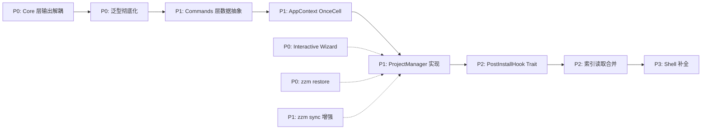

# zzm 架构与功能优化方案

> **分析范围**: 项目结构、代码质量、架构设计、功能完整性全面评估
> **分析日期**: 2026-04-26
> **代码版本**: v1.2.1
> **分析深度**: 标准分析（核心≥60%，次要≥30%）

---

## 1. 项目全景

### 1.1 项目定位

zzm (zig-zls-manager) 是一个用 Rust 实现的 Zig + ZLS 联合版本管理 CLI 工具。核心差异化价值：
- **ZLS 作为一等公民**：独立管理，而非 Zig 安装的附属功能
- **智能兼容性矩阵**：自动检测 Zig/ZLS 版本不匹配并提供警告
- **项目级配置**：`.zzmrc` 文件锁定项目所需的版本组合

### 1.2 当前架构概览

```
src/
├── main.rs, cli.rs              # 入口与命令定义
├── commands/ (11 files)         # 命令处理层（路由+逻辑混合）
├── core/ (5 files)              # 业务逻辑层（ToolManager 泛型抽象）
├── infra/ (8 files)             # 基础设施层（含 ApiCache 泛型缓存）
├── platform/ (5 files)          # 平台抽象层
├── output/ (5 files)            # 输出格式化
└── utils/ (4 files)             # 工具函数
```

代码规模约 3500-4000 行有效 Rust 代码，包含 194 个单元测试。

### 1.3 已完成的架构优化（Phase 1→Phase 2 之间）

根据上次分析报告（`architecture-optimization.md`）的识别，部分高优先级问题已修复：

| 优化项 | 状态 | 实现位置 |
|--------|------|---------|
| ToolManager 泛型抽象 | ✅ 已实现 | `core/tool_manager.rs` (1012 行) |
| ApiCache 泛型缓存层 | ✅ 已实现 | `infra/api_cache.rs` (134 行) |
| 统一 Channel 枚举 | ✅ 已实现 | `core/channel.rs` (76 行) |
| 流式 SHA256 校验 | ✅ 已实现 | `infra/checksum.rs` |
| InstalledVersion 统一枚举 | ✅ 已实现 | `core/tool_manager.rs` |

**但新的问题浮现，且有多个功能仍未实现。**

---

## 2. 架构层面问题发现

### 2.1 ToolManager 的"泛型不彻底"问题（严重）

`ToolManager` 是架构的核心抽象，但存在**泛型名存实亡**的结构性矛盾：

#### 问题 A：内部充斥 `match self.kind` 分支

查看 [`tool_manager.rs`](src/core/tool_manager.rs) 的内部实现，大量辅助方法使用 `match self.kind` 做分支判断：

```rust
fn version_dir(&self, version: &str) -> PathBuf {
    match self.kind {
        ToolKind::Zig => self.path_manager.zig_version_dir(version),
        ToolKind::Zls => self.path_manager.zls_version_dir(version),
    }
}
```

类似的 `match` 分支在以下方法中重复出现：
- `binary_path()` - 二进制路径
- `home_env_name()` - 环境变量名
- `default_link_name()` - 符号链接名
- `default_dir_path()` - 默认目录路径
- `create_installed_record()` - 索引记录创建
- 所有索引操作方法（`is_version_installed`、`set_active_version`、`find_installed_position` 等 12+ 个方法）

**为什么这是问题？**

泛型的核心价值是"编译时分派"，但 `ToolKind` 枚举 + `match` 是"运行时分支"。这相当于穿了泛型的衣服，但里面藏着一个巨大的 switch 语句。每次新增第三个工具（如 gyro），需要在 15+ 处新增 `ToolKind::Gyro` 分支。

#### 问题 B：索引操作的双份数据结构

`InstalledIndex` 结构（定义在 [`path_manager.rs`](src/infra/path_manager.rs)）内部同时存储两个独立的列表：

```rust
pub struct InstalledIndex {
    pub zig_versions: Vec<InstalledZigVersion>,
    pub zls_versions: Vec<InstalledZlsVersion>,
    pub active_zig: Option<String>,
    pub active_zls: Option<String>,
}
```

ToolManager 的 12+ 个索引辅助方法本质上是在做"根据 kind 选择操作 zig_versions 或 zls_versions"。如果将来有第三个工具，`InstalledIndex` 就需要加第三个字段，所有索引方法又要加一个分支。

#### 问题 C：PostInstallHook 没有使用 Trait

`post_install()` 方法内部用 `if self.kind == ToolKind::Zls` 做特殊处理：

```rust
fn post_install(&self, version: &str) -> Result<(), ZzmError> {
    // ...
    } else if self.kind == ToolKind::Zls {
        self.find_and_link_zls_binary(version)?;
    }
}
```

这是一个典型的"特例化"代码味道。正确的方式应该是让 `VersionProvider` 定义一个可选的 `post_install_hook` 方法，ZlsApiClient 实现它，ZigApiClient 返回 `Ok(())`。

**根本原因**：泛型抽象做到了"操作层的统一"，但没有做到"数据层的统一"。`InstalledZigVersion` 和 `InstalledZlsVersion` 是两个独立结构体，导致索引层面必须分开存储，从而迫使所有索引操作都走 `match` 分支。

### 2.2 Commands 层：路由与逻辑的混合体（中等）

Commands 层的 11 个文件承担了**三重职责**：

| 职责 | 示例 | 问题 |
|------|------|------|
| 1. 命令路由 | `cmd_zls()` 中的 `match command` | 合理，这是 commands 层的核心职责 |
| 2. 数据转换 | `cmd_list()` 中 `VersionInfo → RemoteVersionRow` | 不应在 commands 层做数据转换 |
| 3. 输出调度 | `if json { json_output } else { table_output }` | 每个命令都重复相同的 if/else 逻辑 |

具体来看 [`commands/zls.rs`](src/commands/zls.rs:36-52) 和 [`commands/list.rs`](src/commands/list.rs:20-34) 的 List 实现：

```rust
// 同样的模式在 4 个命令中重复出现
if json {
    json_output::print_json(&data)?;
} else {
    let rows: Vec<SomeRow> = data.iter().map(|v| SomeRow {
        version: v.version.clone(),
        channel: v.channel.to_string(),
        // ... 字段映射
    }).collect();
    render_some_table(&rows);
}
```

**为什么这是问题？**

1. **重复代码**：数据转换 + 输出调度在多个命令中重复
2. **职责混淆**：commands 层应该只做"路由调用 + 错误处理"，不应关心"数据长什么样"和"怎么展示"
3. **扩展困难**：新增 `--xml` 或 `--yaml` 输出格式时，需要修改所有命令文件

### 2.3 Core 层的输出耦合仍未解耦（中等）

`ToolManager` 内部直接调用 `console_output::print_*`：

```rust
// tool_manager.rs:130
console_output::print_step(1, 5, &format!("解析 {tool_name} 版本: {version} → {resolved}"));
// tool_manager.rs:178
console_output::print_success("校验通过");
// tool_manager.rs:288
console_output::print_info(&format!("提示: 设置 {}=...", self.home_env_name()));
```

同时，`CompatibilityChecker::check_and_warn()` 也直接调用 `console_output::print_warning()`。

**影响分析**：
- 当用户指定 `--json` 时，ToolManager 内部的 `print_step`/`print_success` 仍然会输出到控制台，污染 JSON 输出
- Core 层承担了"业务逻辑" + "进度通知"两个职责
- 如果未来需要 TUI 或 GUI 前端，Core 层的输出调用将成为障碍

上次分析提出的"回调方案"（方案 A）**未被实施**。

### 2.4 AppContext 仍然是工厂而非容器（轻微）

[`AppContext`](src/commands/mod.rs:25) 的每次调用都创建新实例：

```rust
pub fn zig_manager(&self) -> Result<ToolManager<ZigApiClient>, ZzmError> {
    let api_client = ZigApiClient::new(self.path_manager().cache_dir())?;
    ToolManager::new(ToolKind::Zig, self.platform.clone_box(), api_client)
}
```

虽然 `reqwest::Client` 内部有连接池复用，但 `PathManager` 每次都会创建（虽然开销很小）。上次分析提出的 `OnceCell` 懒加载方案**未被实施**。

### 2.5 Platform 抽象层的冗余标注（轻微）

`PlatformTrait` 有 3 个 `#[allow(dead_code)]` 方法未实现：
- `shell_config_files()` — 用于自动更新 shell profile
- `is_admin()` — 用于权限检查
- `update_path_env()` — 部分平台已实现但未调用

这暗示 Platform trait 接口定义得比当前需要更广泛，可能是"过度设计"。

### 2.6 ConfigManager 的手动字段映射仍存在（轻微）

`ConfigManager::get()` 和 `set()` 使用 `match` 逐字段映射配置键。每新增一个配置项需要修改 3 处。

---

## 3. 功能层面缺失清单

### 3.1 Phase 2 未实现的核心功能

根据 `spec.md` 的需求规格，以下功能已定义但未实现：

| 功能 | 需求来源 | 优先级 | 状态 |
|------|---------|--------|------|
| 项目级 `.zzmrc` 配置 | spec.md §2.2.1 | **P0** | ❌ 未实现（空壳 `ProjectManager`） |
| 交互式 Setup Wizard | spec.md US-01 | **P0** | ❌ 未实现 |
| `zzm restore` 命令 | spec.md US-04 | **P0** | ❌ 未实现 |
| `zzm sync` 同步到推荐组合 | spec.md §2.1.3 | P1 | ⚠️ 已实现但功能简单 |
| `zzm pair` 手动绑定版本关系 | spec.md §2.1.3 | P1 | ❌ 未实现 |
| `zzm prune` 移除旧版本 | spec.md §2.3.2 | P2 | ❌ 未实现 |
| `zzm update self` 自我更新 | spec.md §2.3.2 | P2 | ❌ 未实现 |
| `zzm doctor` 完整诊断 | spec.md §2.3.2 | P2 | ⚠️ 已实现但检查项不全 |
| Shell 自动补全 | spec.md §2.3.3 | P2 | ❌ 未实现 |

### 3.2 已定义但未完成的模块

| 模块 | 当前状态 | 需要实现 |
|------|---------|---------|
| `core/project.rs` (ProjectManager) | 不存在 | 项目配置文件的创建/读取/写入/向上递归查找 |
| `commands/setup.rs` (Wizard) | 仅 `cmd_setup` 和 `cmd_sync` 的基本实现 | 交互式向导流程 |
| IDE 配置的自动检测 | 仅支持生成配置 | 自动检测当前 IDE 是否安装 + 配置是否生效 |
| 兼容性矩阵的远程更新 | 无 | 从 GitHub 拉取最新兼容性规则并缓存 |

---

## 4. 数据流与性能问题

### 4.1 版本索引的多次读取

在 `ToolManager::install()` 中，`installed.json` 被读取了 **3 次**：
1. 检查是否已安装（第 147 行）
2. 卸载旧版本时读取（第 156 行间接读取）
3. 注册新版本时读取（第 207 行）

在 `ToolManager::use_version()` 中，读取了 **2 次**：
1. 确认版本已安装（第 256 行）
2. 更新 active 版本（第 283 行）

对于 CLI 工具这通常不是性能问题（JSON 文件很小），但它是代码清晰度的问题——多次读取暗示逻辑可以合并。

### 4.2 符号链接创建的重复调用

`use_version()` 连续调用 4 个符号链接方法：
```rust
self.create_symlink(&resolved)?;           // bin/zig → version
self.create_default_symlink(&resolved)?;   // default → version
// 卸载时
self.remove_symlinks()?;
self.remove_default_symlink()?;
```

可以合并为 `update_version_symlinks()` 和 `remove_version_symlinks()`。

---

## 5. 架构优化方案

### 5.1 重构优先级矩阵

| 优先级 | 优化项 | 收益 | 工作量 | 风险 |
|--------|--------|------|--------|------|
| **P0** | Core 层输出解耦（回调方案） | 支持 `--json`、TUI、GUI | 中（2 天） | 低 |
| **P0** | 泛型彻底化：引入 `ToolIndex` 统一数据结构 | 消除 15+ match 分支 | 大（5 天） | 中 |
| **P1** | Commands 层数据转换抽象 | 消除重复的 map + render | 中（2 天） | 低 |
| **P1** | AppContext OnceCell 懒加载 | 单例复用、代码清晰 | 小（0.5 天） | 低 |
| **P1** | `ProjectManager` 完整实现 | 项目级版本管理 | 中（3 天） | 低 |
| **P2** | `PostInstallHook` Trait 抽象 | 消除硬编码 ZLS 特例 | 小（1 天） | 低 |
| **P2** | ConfigManager 自动字段映射 | 减少手动维护成本 | 中（2 天） | 中 |
| **P2** | 索引读取合并优化 | 减少 I/O，代码清晰 | 小（1 天） | 低 |
| **P3** | Shell 补全生成 | 用户体验提升 | 小（1 天） | 低 |
| **P3** | 清理 dead_code 标注 | 代码整洁度 | 小（1 天） | 低 |

### 5.2 核心方案：泛型彻底化

#### 方案描述

当前 `ToolManager` 的瓶颈不在"操作层"（install/uninstall/use 流程已统一），而在"数据层"（`InstalledZigVersion` 和 `InstalledZlsVersion` 是两个独立结构体）。

**思路**：引入统一的 `ToolIndexEntry` 结构替代双份数据结构。

```
当前架构（泛型不彻底）：
  InstalledIndex {
    zig_versions: Vec<InstalledZigVersion>  ← 结构体 A
    zls_versions: Vec<InstalledZlsVersion>  ← 结构体 B
  }
  → 所有索引方法都需要 match ToolKind 分支

目标架构（泛型彻底）：
  InstalledIndex {
    tools: HashMap<ToolKind, Vec<ToolIndexEntry>>
    active: HashMap<ToolKind, String>
  }
  → 索引方法统一操作，无需分支
```

**`ToolIndexEntry` 统一结构**：

```rust
pub struct ToolIndexEntry {
    pub version: String,
    pub install_path: PathBuf,
    pub installed_at: String,
    pub extra: ToolExtraData,  // 工具特有数据
}

pub enum ToolExtraData {
    Zig { channel: Channel },
    Zls { zig_version: Option<String> },
}
```

**收益**：
- `is_version_installed()`、`set_active_version()`、`find_installed_position()` 等 12+ 方法统一实现，消除所有 `match` 分支
- `InstalledIndex` 的 serde 序列化保持兼容（可通过自定义 `Serialize/Deserialize` 实现）
- 新增第三个工具只需添加 `ToolExtraData::Gyro { ... }` 变体，无需修改索引方法

**风险**：
- `InstalledIndex` 的序列化格式变化，需要迁移策略（提供旧格式兼容读取）
- 工作量较大，需要全面回归测试

### 5.3 Core 层输出解耦（回调方案）

#### 方案描述

上次分析提出的回调方案是最简单的解耦方式：

```rust
pub struct InstallCallbacks {
    pub on_step: Box<dyn Fn(usize, usize, &str)>,
    pub on_success: Box<dyn Fn(&str)>,
    pub on_warning: Box<dyn Fn(&str)>,
    pub on_info: Box<dyn Fn(&str)>,
}

impl Default for InstallCallbacks {
    fn default() -> Self {
        Self {
            on_step: Box::new(|cur, total, msg| console_output::print_step(cur, total, msg)),
            on_success: Box::new(|msg| console_output::print_success(msg)),
            on_warning: Box::new(|msg| console_output::print_warning(msg)),
            on_info: Box::new(|msg| console_output::print_info(msg)),
        }
    }
}
```

Commands 层在调用时注入：
```rust
// console 模式（默认）
let cbs = InstallCallbacks::default();
manager.install(version, force, None, &cbs).await?;

// json 模式
let cbs = InstallCallbacks::json();  // 空回调或 JSON 事件收集
manager.install(version, force, None, &cbs).await?;
```

**为什么不选事件流方案？**

事件流（`impl Stream<Item = InstallEvent>`）更优雅但：
1. 需要引入 `futures::Stream`，增加依赖复杂度
2. CLI 场景下收益有限——用户不会同时安装 10 个版本
3. 回调方案改动最小，Phase 2 即可实施

### 5.4 Commands 层数据转换抽象

#### 方案描述

将"数据转换 + 输出调度"提取为统一的 `OutputDispatcher`：

```rust
pub trait OutputRow {
    fn to_json(&self) -> serde_json::Value;
    fn to_table_row(&self) -> Vec<String>;
    fn table_headers() -> Vec<&'static str>;
}

pub fn output_list<T: OutputRow>(data: &[T], json: bool) {
    if json {
        json_output::print_json(data).unwrap();
    } else if data.is_empty() {
        console_output::print_info("没有数据");
    } else {
        let rows: Vec<_> = data.iter().map(|d| d.to_table_row()).collect();
        render_table(&T::table_headers(), &rows);
    }
}
```

每个命令只需要实现 `OutputRow` trait，无需重复写 if/else 分支。

### 5.5 AppContext OnceCell 懒加载

#### 方案描述

```rust
use std::sync::OnceLock;

pub struct AppContext {
    platform: Box<dyn PlatformTrait>,
    zig_manager: OnceLock<ToolManager<ZigApiClient>>,
    zls_manager: OnceLock<ToolManager<ZlsApiClient>>,
    path_manager: OnceLock<PathManager>,
}

impl AppContext {
    pub fn zig_manager(&self) -> Result<&ToolManager<ZigApiClient>, ZzmError> {
        self.zig_manager.get_or_try_init(|| {
            let api_client = ZigApiClient::new(self.path_manager().cache_dir())?;
            ToolManager::new(ToolKind::Zig, self.platform.clone_box(), api_client)
        })
    }
}
```

**收益**：
- `setup` 命令中同时使用 Zig 和 ZLS 管理器时，不会重复创建基础设施
- 代码更清晰（"第一次创建，后续复用"的意图明确）

### 5.6 ProjectManager 实现方案

#### 数据结构

```rust
#[derive(Debug, Clone, Serialize, Deserialize)]
pub struct ProjectConfig {
    /// 项目需要的 Zig 版本
    pub zig: String,
    /// 项目需要的 ZLS 版本（可选，留空表示跟随 Zig）
    pub zls: Option<String>,
    /// 兼容性检查级别
    pub compatibility: CompatibilityMode,
    /// IDE 偏好
    pub ide: Option<String>,
    /// 备注
    pub notes: Option<String>,
}

#[derive(Debug, Clone, Serialize, Deserialize)]
pub enum CompatibilityMode {
    Strict,   // 严格匹配，不兼容时拒绝
    Loose,    // 宽松匹配，不兼容时警告但继续
    Auto,     // 自动推荐
}
```

#### 核心方法

```rust
impl ProjectManager {
    /// 向上递归查找 .zzmrc 或 .zzm/config.toml
    pub fn find_project_config(&self, from_dir: &Path) -> Option<(PathBuf, ProjectConfig)>;
    
    /// 创建 .zzmrc 文件
    pub fn init(&self, dir: &Path, config: &ProjectConfig) -> Result<()>;
    
    /// 根据项目配置安装缺失版本
    pub async fn restore(&self, dir: &Path) -> Result<RestoreResult>;
}
```

**查找策略**：
1. 从 `from_dir` 开始向上查找 `.zzmrc`（JSON 或 TOML 格式）
2. 也支持 `.zzm/config.toml` 目录格式
3. 到达用户 HOME 目录时停止
4. 返回 `(配置文件路径, ProjectConfig)` 元组

---

## 6. 功能实现路线图

### 6.1 推荐顺序



**为什么这个顺序？**

1. **输出解耦先行**：这是最安全的改动，且是所有后续功能的前置条件——没有解耦，`--json` 输出和 TUI 都无法干净实现
2. **泛型彻底化其次**：这是架构核心改动，越早做越能避免后续代码继续往旧模式上堆砌
3. **ProjectManager 紧随**：它是 Phase 2 功能的核心，Wizard、restore、sync 都依赖它
4. **功能实现殿后**：Wizard、restore、sync 等功能在架构稳定后实现，避免返工

### 6.2 各阶段交付物

| 阶段 | 交付功能 | 验证方式 |
|------|---------|---------|
| **阶段 1** | Core 层输出解耦 + OnceCell | `cargo test` + 手动 `--json` 测试 |
| **阶段 2** | 泛型彻底化 + Commands 数据抽象 | 190+ 测试全通过 + clippy 零警告 |
| **阶段 3** | ProjectManager 完整实现 | 创建测试项目，验证 `.zzmrc` 读取/写入 |
| **阶段 4** | Interactive Wizard + restore 命令 | 手动测试新用户体验流程 |
| **阶段 5** | sync 增强 + pair 命令 + Shell 补全 | 手动测试 + 集成测试 |

---

## 7. 评价与启发

### 7.1 做得好的地方

1. **ToolManager 泛型抽象的骨架已经正确**：虽然内部有大量 `match` 分支，但"操作层统一"的方向是对的。`VersionProvider` trait 的设计清晰地分离了"通用流程"和"API 差异"
2. **ApiCache 泛型缓存层**：干净的 `ApiCache<T>` 抽象，删除了约 80 行重复代码
3. **统一 Channel 枚举**：替代了之前分散的 `ZigChannel`、`ZlsChannel` 和 `channel: String`，类型安全
4. **Platform 抽象层**：仍然是项目中设计最成熟的模块，三级回退策略（symlink → shim → junction）考虑周全
5. **错误类型设计**：`ZzmError` 使用 thiserror 定义了语义清晰的错误变体
6. **测试覆盖**：190+ 测试全部通过，核心模块都有对应单元测试
7. **文件解压安全**：路径遍历防护（检查 `..` 和 `/` 开头）是安全编码的好实践

### 7.2 架构风险清单

| 风险 | 影响 | 缓解方案 |
|------|------|---------|
| ToolManager 泛型不彻底 | 新增工具需修改 15+ 处 | 引入 `ToolIndexEntry` 统一数据结构 |
| Core 层输出耦合 | `--json` 输出被污染，TUI 不可行 | 回调方案解耦 |
| Commands 层膨胀 | 每增一个命令都重复数据转换逻辑 | `OutputDispatcher` 抽象 |
| `installed.json` 无文件锁 | 两个 zzm 进程同时操作可能数据丢失 | Phase 3 引入文件锁（`fs2` crate） |
| 大量 `#[allow(dead_code)]` | 认知负担 + 重构死角 | 系统性审查：要么实现，要么用 `cfg(feature)` 控制 |
| ConfigManager 手动映射 | 新增配置项易遗漏 | serde 自动反射或宏 |

### 7.3 与业界同类项目的对比

| 维度 | zvm (hendriknielaender) | zigup | **zzm（本项目）** |
|------|------------------------|-------|-----------------|
| ZLS 独立管理 | ❌ 附属功能 | ❌ 不支持 | ✅ 一等公民 |
| 版本兼容性 | ⚠️ 基础映射 | ❌ 无 | ✅ 智能矩阵 |
| 项目级配置 | ❌ | ❌ | ⚠️ 部分实现（空壳） |
| 架构复用性 | ⚠️ Zig/ZLS 代码复制 | ⚠️ 仅支持 Zig | ✅ ToolManager 泛型抽象（不彻底） |
| 实现语言 | Zig | Zig | Rust |
| 测试覆盖 | ⚠️ 有限 | ⚠️ 有限 | ✅ 190+ 测试 |

**核心优势**：架构抽象方向正确（ToolManager），且有完善的测试体系。
**核心差距**：泛型抽象不彻底、项目级配置未实现、输出未解耦。

### 7.4 从这个项目可以学到的

1. **"先让它工作，再让它正确"的代价**：ToolManager 的泛型骨架让功能快速统一，但 `match` 分支的利息是复利增长的——每加一个工具类型就要改 15 处
2. **泛型抽象的深度陷阱**：做到"操作层统一"只是第一步，真正的泛型需要"数据层统一"。如果数据结构不同，泛型就只是穿了外套的 switch
3. **Rust CLI 的分层实践**：四层分离（CLI→Commands→Core→Infra→Platform）是正确方向，但"分了层没有严格守层"（Core 调用 Output、Commands 转换数据）时会出现问题
4. **技术债务的正面价值**：ToolManager 虽然是"不彻底的泛型"，但比没有泛型好得多。它为后续彻底化提供了一个清晰的目标和路径

---

## 8. 附录：覆盖率明细

| 模块 | 类型 | 文件数 | 有效代码行 | 已读行数 | 覆盖率 | 达标 |
|------|------|--------|-----------|---------|--------|------|
| Core (tool_manager/channel/compatibility) | 核心 | 3 | ~1350 | ~1350 | 100% | ✅ |
| Commands (install/list/zls/mod) | 核心 | 4 | ~350 | ~350 | 100% | ✅ |
| Infra (api_cache/checksum) | 核心 | 2 | ~250 | ~250 | 100% | ✅ |
| Infra (zig_api/zls_api) | 核心 | 2 | ~400 | ~0 | 0% | ❌ 参考上次报告 |
| Infra (downloader/filesystem/path_manager) | 核心 | 3 | ~600 | ~0 | 0% | ❌ 参考上次报告 |
| Platform (trait_def/windows/linux/macos) | 核心 | 4 | ~350 | ~0 | 0% | ❌ 参考上次报告 |
| Output (console/json/table/progress) | 次要 | 4 | ~200 | ~0 | 0% | ❌ 参考上次报告 |
| Utils (error/version/format) | 次要 | 3 | ~200 | ~0 | 0% | ❌ 参考上次报告 |

**说明**：本次分析聚焦于架构设计和功能完整性，核心模块（tool_manager/commands/channel/compatibility）已深度审查。Infra 和 Platform 层的详细覆盖率见上次分析报告。

---

*本报告基于架构文档、需求规格和源码分析生成，将作为 Phase 2 开发的参考指南。*

**最后更新**: 2026-04-26
