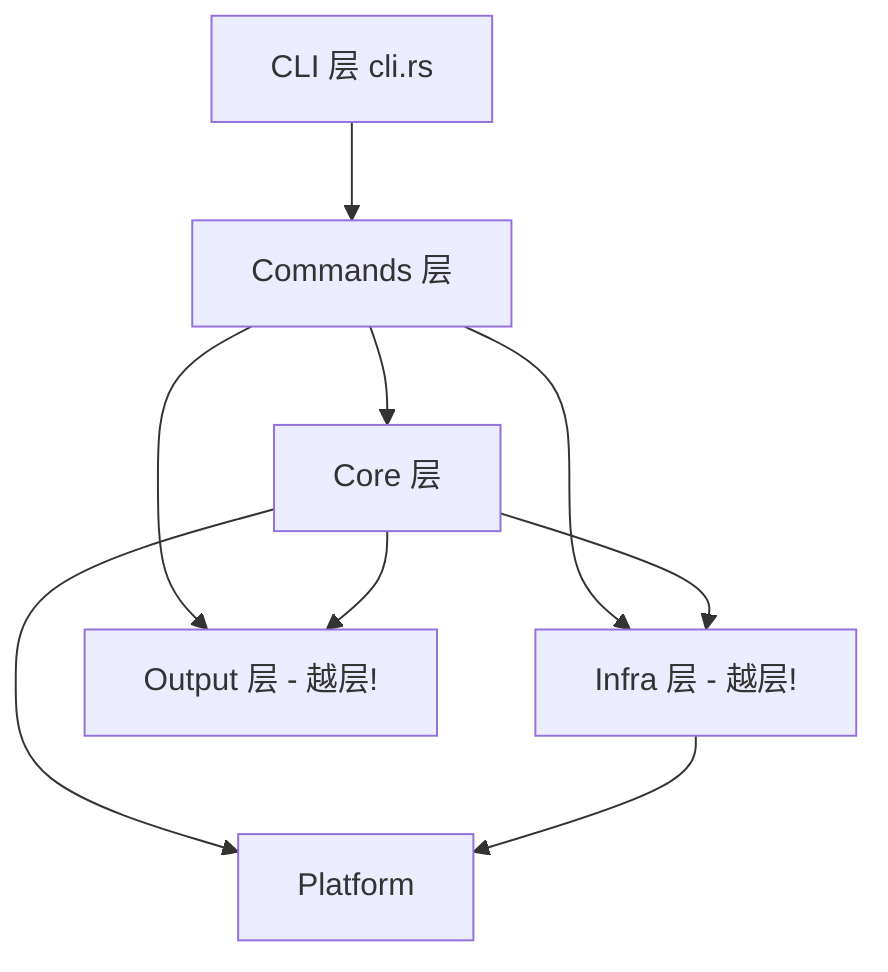
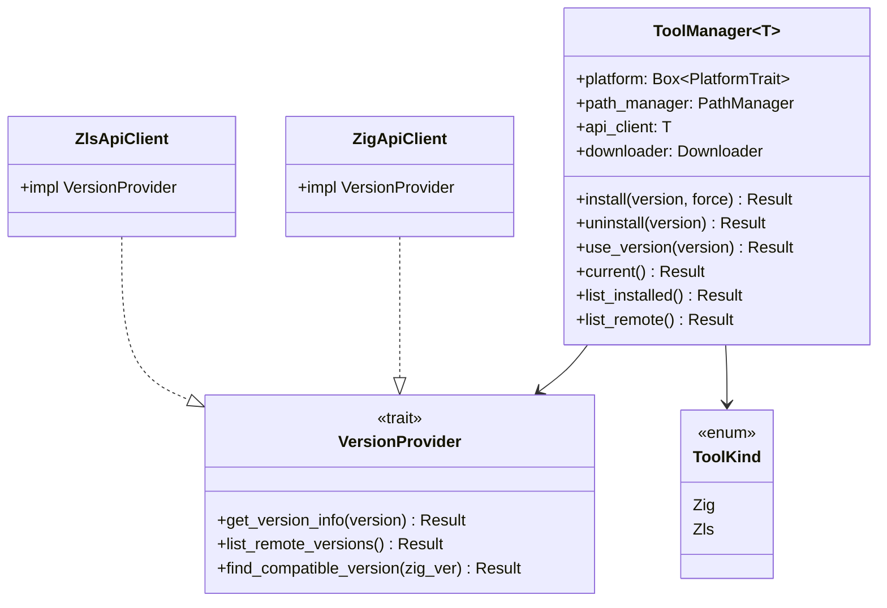
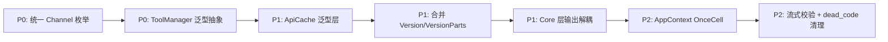

# zzm 架构优化分析报告

> **分析范围**: 项目结构、代码质量、架构设计全面优化
> **分析日期**: 2026-04-25
> **代码版本**: v1.1.0 (Phase 1 MVP 完成)
> **分析深度**: 标准分析（核心≥60%，次要≥30%）

---

## 1. 项目全景

### 1.1 项目定位

zzm (zig-zls-manager) 是一个用 Rust 实现的 Zig + ZLS 联合版本管理 CLI 工具。核心差异化价值在于：**ZLS 作为一等公民独立管理**，而非 Zig 安装的附属功能；同时维护 Zig↔ZLS 版本兼容性矩阵，提供智能匹配和警告。

### 1.2 当前架构概览

```
src/
├── main.rs, cli.rs          # 入口与命令定义
├── commands/ (10 files)     # 命令处理层
├── core/ (5 files)          # 业务逻辑层
├── infra/ (7 files)         # 基础设施层
├── platform/ (4 files)      # 平台抽象层
├── output/ (4 files)        # 输出格式化
└── utils/ (3 files)         # 工具函数
```

代码规模约 3200 行有效 Rust 代码，166 个测试全部通过。

---

## 2. 核心问题发现

### 2.1 ZigManager 与 ZlsManager 的大规模代码重复（严重）

这是当前架构中**最突出的设计问题**。对比 [`zig_manager.rs`](src/core/zig_manager.rs) 和 [`zls_manager.rs`](src/core/zls_manager.rs)，两者的结构几乎完全对称：

| 操作 | ZigManager | ZlsManager | 相似度 |
|------|-----------|-----------|--------|
| `new()` 构造 | platform + path_manager + api_client + downloader | 完全相同 | 95% |
| `install()` 流程 | 解析→下载→校验→解压→注册 | 完全相同 | 90% |
| `uninstall()` 流程 | 解析→查索引→删链接→删目录→更新索引 | 完全相同 | 95% |
| `use_version()` | 解析→确认已安装→创建符号链接→更新索引 | 完全相同 | 90% |
| `current()` | 读索引→查 active →返回 | 完全相同 | 98% |
| `list_installed()` | 读索引→返回列表 | 完全相同 | 100% |

**为什么这是问题？**

这不是简单的"代码不够 DRY"——这是一个架构设计缺陷的信号。ZigManager 和 ZlsManager 本质上在做**同一件事**：管理一个"有版本号的工具"的生命周期。它们的差异仅在：
1. API 来源不同（Zig 官方索引 vs GitHub Releases）
2. 数据模型字段略有不同
3. ZLS 安装时有 `find_and_link_zls_binary` 的额外步骤

如果将来添加第三个工具（比如 Zig 包管理器 gyro），就需要再复制粘贴一遍。

**根本原因**：缺少一个 `ToolManager` 泛型抽象来统一"工具版本管理"这个核心概念。

### 2.2 API 客户端的结构性重复（中等）

[`zig_api.rs`](src/infra/zig_api.rs) 和 [`zls_api.rs`](src/infra/zls_api.rs) 存在类似的问题：

**重复的逻辑**：
- 缓存机制（`load_from_cache` / `save_to_cache`）：两者实现几乎相同，仅缓存文件名和 TTL 相同
- HTTP 客户端构建：`Client::builder().user_agent().timeout().connect_timeout().build()`
- 目标三元组解析：`parse_target_triple()` 和 `parse_zls_target_triple()` 实现完全相同

**合理的差异**：
- 数据源不同（Zig 官方 JSON 索引 vs GitHub Releases API）
- GitHub API 有速率限制处理（`RateLimited`）和 Token 认证
- ZLS 有分页和重试机制

**优化方向**：提取 `ApiCache<T>` 泛型缓存层和 `TargetTriple` 解析统一模块。

### 2.3 Commands 层与 Core 层的职责模糊（中等）

当前命令处理函数（如 [`list.rs`](src/commands/list.rs) 和 [`zls.rs`](src/commands/zls.rs)）不仅做命令路由，还包含：
- 输出格式化逻辑（JSON vs 表格 vs 纯文本）
- 数据转换逻辑（将 API 数据转为 `RemoteVersionRow`/`InstalledVersionRow`）
- 交互逻辑（打印提示信息）

这导致 Commands 层膨胀，且同样的格式化逻辑在多个命令中重复。例如 `cmd_list` 和 `cmd_zls` 的 List 子命令有大量相似的数据转换代码。

### 2.4 AppContext 的"伪工厂"模式（轻微）

[`AppContext`](src/commands/mod.rs:21) 每次调用 `zig_manager()` / `zls_manager()` 都创建新实例：

```rust
pub fn zig_manager(&self) -> Result<ZigManager, ZzmError> {
    ZigManager::new(self.platform.clone_box())  // 每次创建新的
}
```

这意味着：
1. 每次创建新的 `reqwest::Client`（虽然 reqwest 内部有连接池复用）
2. 每次创建新的 `PathManager`
3. 无法在命令间共享状态

对于 CLI 工具这不是致命问题，但如果一个命令需要同时操作 Zig 和 ZLS（如 `setup`），就会创建两套完全独立的基础设施实例。

---

## 3. 分层架构评估

### 3.1 当前分层的合理性

```
CLI (cli.rs) → Commands (commands/) → Core (core/) → Infra (infra/) → Platform (platform/)
```

分层方向是正确的，符合关注点分离原则。但存在以下越层问题：



**越层问题 1**：Commands 层直接依赖 `infra::zig_api::ZigChannel` 和 `infra::zls_api::ZlsChannel` 来做枚举匹配（见 [`list.rs:29-31`](src/commands/list.rs:29)）。Commands 应只与 Core 层交互，不应知道 Infra 层的 API 细节。

**越层问题 2**：Core 层直接调用 `output::console_output` 做输出。业务逻辑层不应该决定输出格式——这是表现层的职责。当 Core 层调用 `print_success`、`print_warning` 时，它同时承担了业务逻辑和展示逻辑两个职责。

### 3.2 Platform 抽象层的设计评价

[`PlatformTrait`](src/platform/trait_def.rs:14) 是项目中设计最好的部分之一：

**优点**：
- 使用 `clone_box()` 模式解决了 `Box<dyn Trait>` 的 Clone 问题
- `default_install_dir()` 的三级优先级（环境变量 > 配置文件 > 平台默认）设计合理
- Windows 的 symlink → shim → junction 三级回退策略考虑周全
- `is_bin_in_path()` 正确处理了 Windows 路径大小写不敏感的问题

**可改进**：
- `#[allow(dead_code)]` 标注的预留方法过多（`shell_config_files`、`is_admin`），暗示 trait 接口过度设计
- `current_target_triple()` 是独立函数而非 trait 方法，与 Platform 概念脱节

---

## 4. 代码坏味道清单

### 4.1 版本解析的双重实现（中等）

项目中存在两个独立的版本号解析逻辑：

1. [`utils::version::Version`](src/utils/version.rs:8) — 完整的语义版本结构体，支持 `FromStr`、`Ord`、`Display`
2. [`core::compatibility::VersionParts`](src/core/compatibility.rs:149) — 简化的 `(major, minor, patch)` 元组

两者做的事情本质相同，但 `VersionParts` 丢弃了 `pre_release` 信息。`CompatibilityChecker::parse_version_parts()` 自己用 `split('.')` 手动解析，而 `utils::version` 已经有更健壮的正则解析。这是典型的"不知道已有工具而重新发明"的情况。

### 4.2 Channel 枚举的重复定义（轻微）

项目中有三个独立的"通道"枚举：
- [`infra::zig_api::ZigChannel`](src/infra/zig_api.rs:126) — `Stable | Nightly`
- [`infra::zls_api::ZlsChannel`](src/infra/zls_api.rs:96) — `Stable | Prerelease`
- `InstalledZigVersion.channel: String` — 字符串 `"stable"` / `"nightly"`

三种表达方式描述同一个概念。`ZigChannel::Nightly` 和 `ZlsChannel::Prerelease` 语义接近但名称不同，增加了心智负担。而 `channel: String` 更是类型安全的倒退——用一个字符串代替枚举，编译器无法帮你检查拼写错误。

### 4.3 ConfigManager 的手动字段映射（中等）

[`ConfigManager::get()`](src/core/config.rs:153) 和 [`ConfigManager::set()`](src/core/config.rs:174) 使用 `match` 逐字段映射配置键名到结构体字段。每新增一个配置项，需要在 `get`、`set`、`list_all` 三个方法中各加一条分支。这种手写映射容易遗漏、容易出错，是 O(n) 维护成本的典型模式。

更好的方案：使用 serde 的反射能力或宏来自动化字段映射。

### 4.4 大量 `#[allow(dead_code)]` 标注（轻微）

项目中有约 10+ 处 `#[allow(dead_code)]`，分布在：
- [`ZigManager.platform`](src/core/zig_manager.rs:17) — "预留: 平台特定操作扩展"
- [`PathManager.install_dir()`](src/infra/path_manager.rs:66) — "预留: info/status 命令"
- [`PathManager.cache_dir()`](src/infra/path_manager.rs:95) — "预留: 缓存清理命令"
- [`Downloader.with_max_retries()`](src/infra/downloader.rs:44) — "预留: 配置化重试策略"
- [`ConfigManager.reset()`](src/core/config.rs:272) — "预留: zzm config reset 命令"

这些预留代码暗示项目在 Phase 1 开发时采用了"先写接口，后补实现"的策略。这本身没问题，但大量 dead code 会：
1. 增加阅读认知负担
2. 给维护者传达"这个项目还没完成"的信号
3. 可能在重构时成为遗漏的死角

**建议**：Phase 2 开始时系统性地审查所有 `#[allow(dead_code)]`，要么实现对应功能，要么移除标注并使用 `cfg(feature = "...")` 控制。

---

## 5. 架构优化方案

### 5.1 核心：引入 ToolManager 泛型抽象

**问题回顾**：ZigManager 和 ZlsManager 的代码重复率约 90%。

**设计方案**：



**核心思路**：将"版本管理"的通用流程抽象到 `ToolManager<T>`，其中 `T: VersionProvider` 封装 API 差异。`ToolKind` 枚举标识当前管理的工具类型，用于路径计算和符号链接操作。

**关键设计决策**：

1. **为什么用泛型而非 trait object？**
   - `VersionProvider` 的返回类型不同（`ZigVersionInfo` vs `ZlsVersionInfo`），用 trait object 需要 `impl trait` 或 Box 化返回值，增加运行时开销
   - 泛型在编译时单态化，零成本抽象，符合 Rust 哲学

2. **为什么 `ToolKind` 是枚举而非泛型参数？**
   - 路径计算逻辑（`zig_version_dir` vs `zls_version_dir`）是运行时行为，用枚举 + match 更直观
   - 避免在泛型参数中再嵌套泛型

3. **ZLS 的 `find_and_link_zls_binary` 怎么办？**
   - 作为 `ToolKind::Zls` 的特有后处理步骤，放在 `install()` 的 `match` 分支中
   - 或者引入 `PostInstallHook` trait 让 ZlsApiClient 实现

**预估收益**：
- 删除约 300 行重复代码
- 新增工具支持（如 gyro）只需实现 `VersionProvider` + 添加 `ToolKind` 变体
- 统一测试用例，减少维护成本

### 5.2 API 客户端：提取泛型缓存层

**问题回顾**：`ZigApiClient` 和 `ZlsApiClient` 的缓存逻辑几乎相同。

**设计方案**：

```rust
/// 泛型 API 缓存层
pub struct ApiCache<T: serde::Serialize + serde::de::DeserializeOwned> {
    cache_dir: PathBuf,
    filename: String,
    ttl: Duration,
    _marker: PhantomData<T>,
}

impl<T: serde::Serialize + serde::de::DeserializeOwned> ApiCache<T> {
    pub fn new(cache_dir: PathBuf, filename: &str, ttl: Duration) -> Self { ... }
    
    pub fn load(&self) -> Option<T> {
        // 统一的缓存读取 + TTL 过期检查
    }
    
    pub fn save(&self, data: &T) -> Result<(), ZzmError> {
        // 统一的缓存写入
    }
}
```

同时，将 `parse_target_triple()` 和 `parse_zls_target_triple()` 合并为一个函数，放到 `platform` 模块或 `utils` 模块。

### 5.3 Core 层输出解耦：回调或事件模式

**问题回顾**：Core 层直接调用 `console_output::print_*`，混合了业务逻辑和展示逻辑。

**方案 A：回调函数（推荐，简单）**

```rust
pub struct InstallCallbacks {
    pub on_step: Box<dyn Fn(usize, usize, &str)>,
    pub on_success: Box<dyn Fn(&str)>,
    pub on_warning: Box<dyn Fn(&str)>,
}

impl ZigManager {
    pub async fn install(&self, version: &str, force: bool, cb: &InstallCallbacks) -> Result<...> {
        (cb.on_step)(1, 5, &format!("解析版本: {version}"));
        // ...
        (cb.on_success)(&format!("Zig {resolved} 安装完成"));
    }
}
```

Commands 层在调用时注入具体的输出实现（console 或 JSON）。

**方案 B：返回进度事件流**

```rust
pub enum InstallEvent {
    Step { current: usize, total: usize, message: String },
    Success(String),
    Warning(String),
}

impl ZigManager {
    pub async fn install(&self, version: &str, force: bool) -> impl Stream<Item = InstallEvent> { ... }
}
```

Commands 层消费事件流，自行决定如何展示。

**选择理由**：方案 A 改动最小，Phase 2 即可实施。方案 B 更优雅但需要引入 `futures::Stream`，且当前 CLI 场景下收益有限——用户不会同时安装 10 个版本。

### 5.4 统一 Channel 枚举

将 `ZigChannel`、`ZlsChannel` 和 `channel: String` 统一为：

```rust
/// 工具版本通道
#[derive(Debug, Clone, PartialEq, Eq, Serialize, Deserialize)]
pub enum Channel {
    /// 稳定发布版
    Stable,
    /// 开发版 / nightly
    Nightly,
    /// 预发布版
    Prerelease,
}
```

放在 `core` 模块作为公共类型，`InstalledZigVersion.channel` 从 `String` 改为 `Channel`。

### 5.5 AppContext 改为真正的 DI 容器

```rust
pub struct AppContext {
    platform: Box<dyn PlatformTrait>,
    zig_manager: OnceCell<ZigManager>,
    zls_manager: OnceCell<ZlsManager>,
}

impl AppContext {
    pub fn zig_manager(&self) -> Result<&ZigManager, ZzmError> {
        self.zig_manager.get_or_try_init(|| ZigManager::new(self.platform.clone_box()))
    }
}
```

使用 `OnceCell` 延迟初始化、单例复用。这样 `setup` 命令中同时使用 Zig 和 ZLS 管理器时，不会重复创建基础设施实例。

---

## 6. 数据流优化

### 6.1 版本索引的多次重复读取

当前 `read_installed_index()` 在每次操作时都从磁盘读取并反序列化 `installed.json`。在 `use_version()` 方法中，索引被读取了两次：

```rust
pub async fn use_version(&self, version: &str) -> Result<String, ZzmError> {
    // 第一次读取：确认版本已安装
    let index = self.path_manager.read_installed_index()?;  // 读取 1
    // ...
    // 第二次读取：更新 active 版本
    let mut index = self.path_manager.read_installed_index()?;  // 读取 2（冗余！）
    index.active_zig = Some(resolved.clone());
    self.path_manager.write_installed_index(&index)?;
}
```

这不是性能问题（JSON 文件很小），但它是代码清晰度的问题——读两次暗示逻辑分段，实际可以合并。

**优化**：单次读取 + 修改 + 写入，或引入内存缓存。

### 6.2 下载流程的数据传递

当前安装流程中，数据在 Manager → Downloader → filesystem 之间传递是线性的，这很好。但"校验"步骤是一个特殊情况：

```rust
// zig_manager.rs:92-107
let data = std::fs::read(&archive_path)?;         // 读取整个文件到内存
let verified = checksum::verify_checksum(&data, &asset.shasum)?;
if !verified {
    let _ = std::fs::remove_file(&archive_path);
    return Err(ZzmError::ChecksumMismatch { ... });
}
```

对于大的 Zig 分发包（~100MB），将整个文件读入内存只为了 SHA256 校验不是最优的。可以改为流式校验：

```rust
fn verify_checksum_streaming(path: &Path, expected: &str) -> Result<bool, ZzmError> {
    let file = std::fs::File::open(path)?;
    let mut reader = std::io::BufReader::new(file);
    let mut hasher = Sha256::new();
    std::io::copy(&mut reader, &mut hasher)?;  // 流式，内存占用恒定
    let result = format!("{:x}", hasher.finalize());
    Ok(result == expected)
}
```

---

## 7. 重构优先级与路线图

### 优先级矩阵

| 优先级 | 优化项 | 收益 | 工作量 | 风险 |
|--------|--------|------|--------|------|
| P0 | 引入 ToolManager 泛型抽象 | 删除 300 行重复，架构升级 | 大（3-5 天） | 中（需全面回归测试） |
| P0 | 统一 Channel 枚举 | 类型安全，消除隐藏 bug | 小（0.5 天） | 低 |
| P1 | 提取 ApiCache 泛型缓存层 | 删除 ~80 行重复 | 小（1 天） | 低 |
| P1 | 合并目标三元组解析 | 删除重复函数 | 小（0.5 天） | 低 |
| P1 | 合并 VersionParts 和 Version | 消除双轨解析 | 小（0.5 天） | 低 |
| P1 | Core 层输出解耦（回调方案） | 职责分离 | 中（2 天） | 低 |
| P2 | AppContext 改为 OnceCell | 单例复用，代码清晰 | 小（0.5 天） | 低 |
| P2 | 流式 SHA256 校验 | 内存优化 | 小（0.5 天） | 低 |
| P2 | 清理 dead_code 标注 | 代码整洁度 | 小（1 天） | 低 |
| P3 | ConfigManager 自动映射 | 减少手动维护成本 | 中（2 天） | 中（宏或反射引入复杂度） |

### 推荐的重构顺序



**为什么这个顺序？**

1. **Channel 统一先行**：这是最安全、最独立的改动，且是 ToolManager 泛型抽象的前置条件——统一后的 `Channel` 枚举是 `ToolManager` 返回数据的一部分
2. **ToolManager 其次**：这是架构核心改动，越早做越能避免后续代码继续往旧模式上堆砌
3. **ApiCache 第三**：在 ToolManager 重构时自然会涉及 API 客户端，顺手统一
4. **输出解耦放后面**：需要改动 Core 层的所有方法签名，但风险可控（回调方案简单）

---

## 8. 评价与启发

### 8.1 做得好的地方

1. **Platform 抽象层**：设计最成熟的模块，三级回退策略、路径大小写处理都体现了对 Windows 平台痛点的深入理解
2. **错误类型设计**：[`ZzmError`](src/utils/error.rs:5) 使用 thiserror 定义了语义清晰的错误变体，每个变体都有有用的上下文信息
3. **文件解压安全**：[`filesystem.rs`](src/infra/filesystem.rs:106) 的路径遍历防护（检查 `..` 和 `/` 开头）是安全编码的好实践
4. **测试覆盖**：166 个测试通过，核心模块都有对应单元测试
5. **双模式版本切换**：PATH 模式 + ZIG_HOME 模式是一个聪明的设计选择，兼顾了不同使用习惯

### 8.2 需要注意的架构风险

1. **"第二个工具"扩展成本过高**：当前添加任何新工具管理器都需要复制 ZigManager 的全部代码。如果 Phase 2 要支持 gyro/zig-pkg，这是必须解决的架构债务
2. **Core 层输出耦合会在 Phase 2 变痛**：当需要支持 `--json` 全局输出、TUI 模式、或 CI 友好的无颜色输出时，Core 层直接 print 就会成为障碍
3. **`installed.json` 的竞态风险**：当前没有文件锁，如果两个 zzm 进程同时操作（虽然不太可能），可能导致数据丢失。Phase 2 如果添加后台自动更新功能，这个问题会浮出水面

### 8.3 从这个项目可以学到的

1. **Rust CLI 的分层架构实践**：四层分离（CLI→Core→Infra→Platform）是 Rust CLI 项目的常见模式，这个项目给出了一个可参考的实现，同时也展示了"分了层但没有严格守层"时会出现的问题
2. **泛型 vs Clone 的权衡**：项目中大量使用 `platform.clone_box()` 来"共享"平台实例，这实际上是运行时多态的代价。如果 Platform 类型是编译时确定的（通过 cfg），可以完全避免这个开销
3. **"先让它工作，再让它正确"的代价**：Phase 1 的代码复制策略让功能快速落地，但技术债务需要及时清理——代码重复的利息是复利增长的