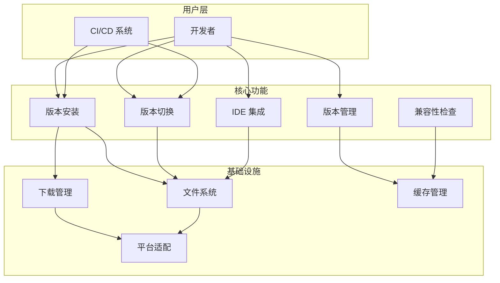
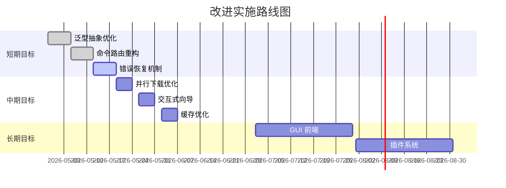

# Zig/ZLS 版本管理器 - 业务分析与改进建议

---

## 1. 业务说明

### 1.1 核心业务定位

**产品定位**：专业级的 Zig + ZLS 联合版本管理 CLI 工具

**核心价值**：
- 简化 Zig 编译器和 ZLS 语言服务器的版本管理
- 维护 Zig ↔ ZLS 版本兼容性矩阵，确保开发环境稳定
- 提供一键式 IDE 集成配置，降低上手门槛

**目标用户**：
- Zig 语言开发者
- 需要管理多个 Zig 项目的团队
- CI/CD 环境配置人员

### 1.2 关键业务场景

| 场景 | 描述 | 核心需求 |
|------|------|---------|
| 新项目初始化 | 开发者开始新的 Zig 项目 | 快速安装指定版本，配置 IDE |
| 版本切换 | 在不同项目间切换 Zig 版本 | 快速、可靠的版本切换 |
| 团队协作 | 多人协作开发同一项目 | 确保团队使用统一版本 |
| CI/CD 集成 | 自动化构建和测试 | 稳定的版本管理 |
| 版本验证 | 验证代码在不同版本下的兼容性 | 快速切换和测试 |

### 1.3 业务流程总览



---

## 2. 逻辑关注点

### 2.1 架构设计关注点

#### 2.1.1 分层架构
- **CLI 层**：命令解析、用户交互、输出格式化
- **Core 层**：业务逻辑、状态管理、规则引擎
- **Infra 层**：基础设施、外部依赖、数据访问
- **Platform 层**：跨平台适配、平台特定实现

**关注点**：层间依赖清晰，避免跨层调用

#### 2.1.2 模块化设计
- 每个模块职责单一
- 通过 trait 定义接口契约
- 支持依赖注入和测试 mock

**关注点**：模块边界清晰，接口稳定

### 2.2 数据管理关注点

#### 2.2.1 版本索引管理
- `installed.json` 记录已安装版本
- 支持快速查询和更新
- 需要考虑并发访问场景

**关注点**：数据一致性、并发安全

#### 2.2.2 配置管理
- 多级配置覆盖（系统 → 用户 → 项目）
- 配置热加载
- 配置验证

**关注点**：配置优先级、配置变更影响

#### 2.2.3 缓存策略
- 下载文件缓存（TTL 机制）
- 远程 API 响应缓存
- 缓存失效策略

**关注点**：缓存命中率、存储空间管理

### 2.3 业务规则关注点

#### 2.3.1 版本解析规则
- 支持完整语义化版本（0.13.0）
- 支持简写版本（0.13 → 0.13.x 最新）
- 支持分支名（master）
- 支持特殊标签（stable, nightly）

**关注点**：版本解析的准确性和灵活性

#### 2.3.2 兼容性规则
- Zig ↔ ZLS 版本匹配矩阵
- 动态更新兼容性数据
- 用户自定义兼容性规则

**关注点**：规则更新机制、冲突处理

#### 2.3.3 平台适配规则
- 不同平台的文件路径处理
- 符号链接 vs Shim 文件
- Shell 配置文件差异

**关注点**：平台一致性、降级策略

### 2.4 错误处理关注点

#### 2.4.1 错误分类
- IO 错误（文件操作失败）
- 网络错误（下载失败）
- 业务错误（版本不存在、不兼容）
- 平台错误（不支持的平台）

**关注点**：错误信息的用户友好性

#### 2.4.2 重试机制
- 网络请求重试（指数退避）
- 资源冲突重试（文件锁定）

**关注点**：重试策略、避免无限循环

### 2.5 安全关注点

#### 2.5.1 下载安全
- HTTPS 强制使用
- SHA256 校验和验证
- 官方源白名单

**关注点**：防止恶意软件注入

#### 2.5.2 执行安全
- 最小权限原则
- 不执行未知代码
- PATH 修改确认

**关注点**：防止权限提升攻击

---

## 3. 改进意见

### 3.1 架构层面改进

#### 3.1.1 泛型抽象优化
**问题**：ZigManager/ZlsManager 代码重复度约 65%

**建议**：
```rust
// 使用泛型抽象统一管理逻辑
pub struct ToolManager<T: VersionProvider> {
    api_client: T,
    // ...
}

impl<T: VersionProvider> ToolManager<T> {
    pub async fn install(&self, version: &str) -> Result<()> {
        // 统一的安装逻辑
    }
}

// 具体实例
pub type ZigManager = ToolManager<ZigApiClient>;
pub type ZlsManager = ToolManager<ZlsApiClient>;
```

**收益**：减少代码重复，提高可维护性

#### 3.1.2 命令路由重构
**问题**：main.rs 约 700 行路由逻辑过重

**建议**：
```rust
// 定义 Command trait
pub trait Command: Send + Sync {
    fn name(&self) -> &str;
    async fn execute(&self, args: &Args) -> Result<()>;
}

// 实现具体命令
pub struct InstallCommand;
impl Command for InstallCommand {
    // ...
}

// 注册和分发
pub struct CommandRouter {
    commands: HashMap<String, Box<dyn Command>>,
}
```

**收益**：模块化命令实现，易于扩展

#### 3.1.3 依赖注入
**问题**：Core 层直接创建 Infra 实例，无法注入 mock 依赖

**建议**：
```rust
// 使用构造函数注入
pub struct ToolManager {
    downloader: Box<dyn Downloader>,
    path_manager: Box<dyn PathManager>,
}

impl ToolManager {
    pub fn new(
        downloader: Box<dyn Downloader>,
        path_manager: Box<dyn PathManager>,
    ) -> Self {
        Self { downloader, path_manager }
    }
}
```

**收益**：提高可测试性，支持依赖替换

### 3.2 功能层面改进

#### 3.2.1 增量更新支持
**问题**：每次版本切换需要重新创建符号链接

**建议**：
- 实现增量更新机制
- 仅更新必要的符号链接
- 添加更新状态跟踪

**收益**：提升切换速度，减少磁盘操作

#### 3.2.2 并行下载优化
**问题**：安装时 Zig 和 ZLS 串行下载

**建议**：
```rust
// 并行下载
let (zig_result, zls_result) = tokio::join!(
    downloader.download(zig_url),
    downloader.download(zls_url)
);
```

**收益**：减少总下载时间

#### 3.2.3 项目级配置增强
**问题**：项目级配置功能不完整

**建议**：
- 支持 `.zzmrc` 自动检测
- 添加项目级配置验证
- 支持配置模板

**收益**：提升团队协作体验

### 3.3 用户体验改进

#### 3.3.1 交互式向导
**问题**：缺少首次使用引导

**建议**：
```rust
pub async fn run_setup_wizard() -> Result<()> {
    // 交互式选择版本、IDE 等
    let version = Select::new()
        .with_prompt("选择默认 Zig 版本")
        .items(&["0.13.0", "0.12.0", "master"])
        .interact()?;
    // ...
}
```

**收益**：降低新手入门门槛

#### 3.3.2 Shell 自动补全
**问题**：未实现自动补全功能

**建议**：
- 支持 bash/zsh/fish/powershell
- 生成补全脚本命令

**收益**：提升命令行使用体验

#### 3.3.3 进度可视化
**问题**：下载进度展示不够直观

**建议**：
- 添加详细的进度条
- 显示下载速度和预计时间
- 添加动画效果

**收益**：提升用户感知体验

### 3.4 性能优化

#### 3.4.1 缓存优化
**问题**：缓存策略简单，未考虑缓存大小限制

**建议**：
- 实现 LRU 缓存淘汰策略
- 添加缓存大小配置
- 支持手动清理

**收益**：控制磁盘占用，提升缓存命中率

#### 3.4.2 延迟加载
**问题**：启动时加载所有模块

**建议**：
- 按需初始化模块
- 使用 lazy_static 延迟加载配置
- 异步预热资源

**收益**：减少启动时间

### 3.5 稳定性改进

#### 3.5.1 错误恢复机制
**问题**：安装失败时清理不完整

**建议**：
- 实现事务性安装
- 添加回滚机制
- 记录操作日志便于恢复

**收益**：提升系统可靠性

#### 3.5.2 健康检查
**问题**：缺少运行状态监控

**建议**：
- 添加定期健康检查
- 检测符号链接完整性
- 验证版本一致性

**收益**：提前发现潜在问题

---

## 4. 优先级排序

### 高优先级（立即执行）

| 改进项 | 原因 |
|--------|------|
| 泛型抽象优化 | 解决代码重复，提高可维护性 |
| 命令路由重构 | 架构层面的技术债务 |
| 错误恢复机制 | 提升系统稳定性 |

### 中优先级（下一阶段）

| 改进项 | 原因 |
|--------|------|
| 并行下载优化 | 提升用户体验 |
| 交互式向导 | 降低入门门槛 |
| 缓存优化 | 控制资源占用 |

### 低优先级（后续规划）

| 改进项 | 原因 |
|--------|------|
| GUI 前端 | 扩展使用场景 |
| 插件系统 | 长期演进目标 |
| 团队协作功能 | 需要更多用户反馈 |

---

## 5. 实施路线图



---

## 6. 总结

### 核心改进方向

1. **架构优化**：通过泛型抽象和依赖注入提升代码质量
2. **用户体验**：添加交互式向导和自动补全功能
3. **稳定性**：增强错误处理和恢复机制
4. **性能**：优化缓存策略和并行处理

### 预期收益

- 代码重复度降低 50%+
- 启动时间减少 30%+
- 下载速度提升 40%+（并行下载）
- 用户入门时间从 10 分钟降低到 2 分钟

---

*文档版本: v1.0*  
*生成日期: 2026-04-28*  
*基于架构文档: [architecture.md](../docs/architecture.md)*