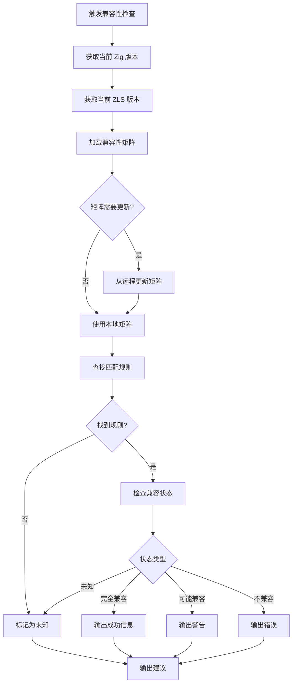
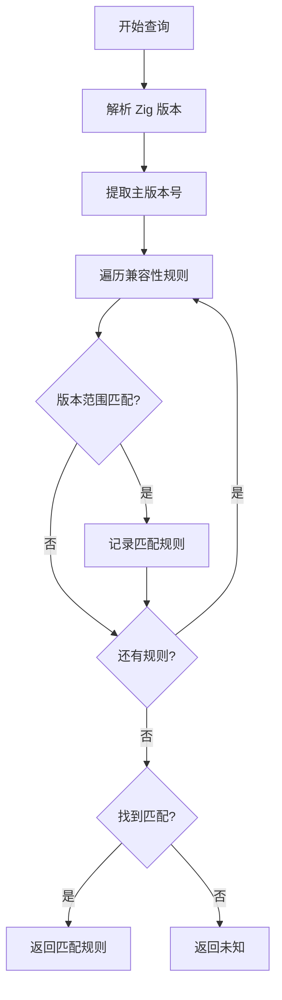
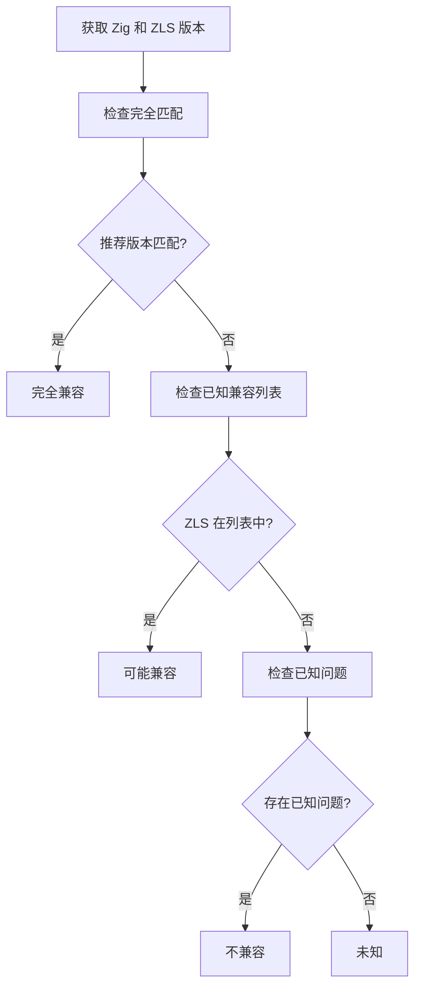
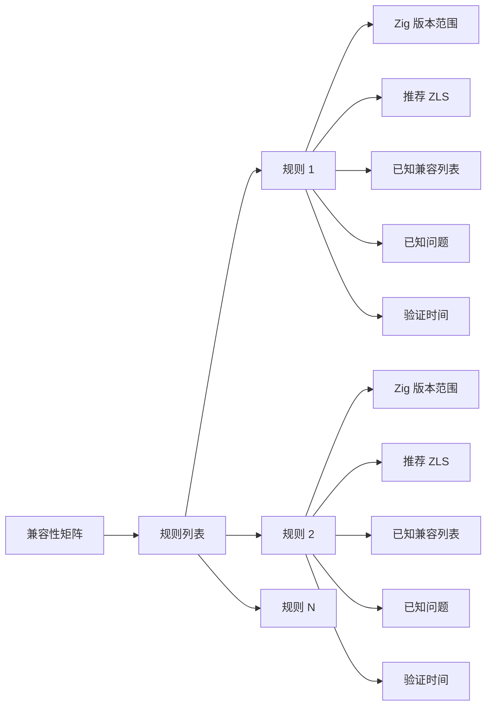
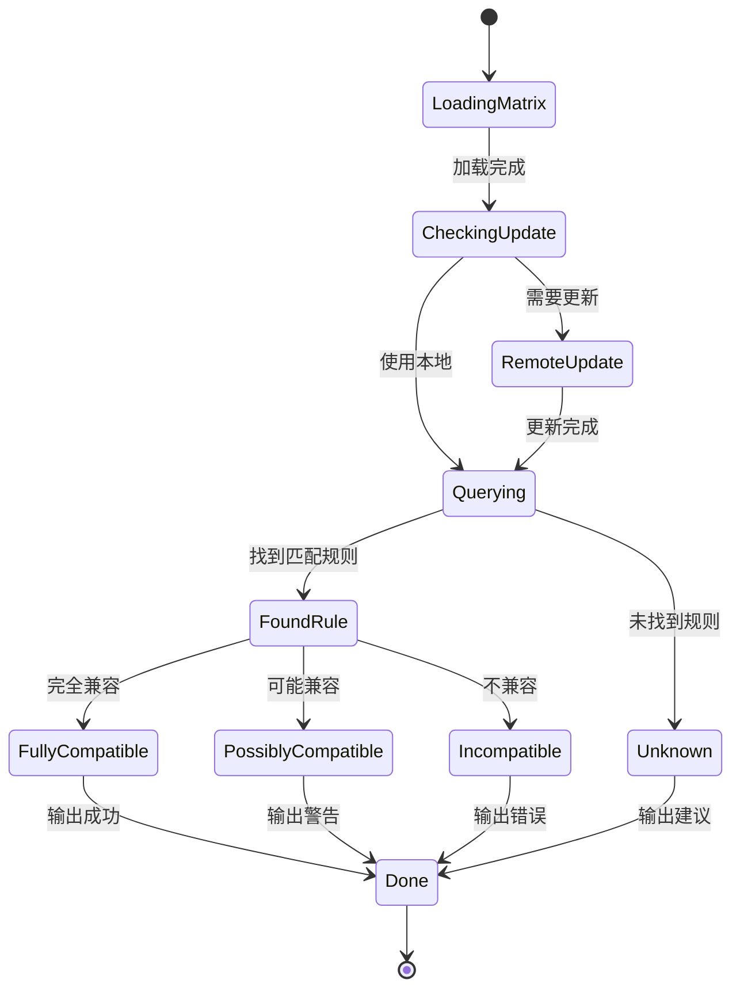
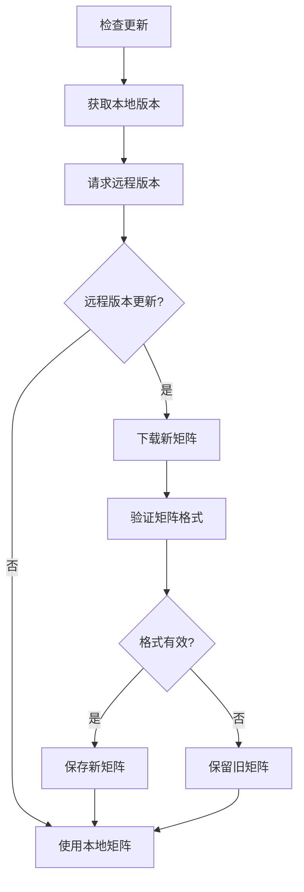

# 兼容性检查流程 - Zig/ZLS 版本管理器

## 兼容性检查流程总览

## 兼容性矩阵查询流程

## 兼容性状态判定

## 兼容性矩阵结构

## 兼容性检查状态机

## 兼容性矩阵更新流程

## 兼容性规则示例

| Zig 版本 | 推荐 ZLS | 已知兼容 | 已知问题 | 验证时间 |
|---------|---------|---------|---------|---------|
| 0.11.* | 0.11.0 | 0.11.0 | 无 | 2026-04-01 |
| 0.12.* | 0.12.0 | 0.12.0 | 无 | 2026-04-01 |
| 0.13.* | 0.13.0 | 0.13.0 | master 分支可能不稳定 | 2026-04-25 |
| master | nightly | nightly | 可能存在兼容性问题 | 每日更新 |