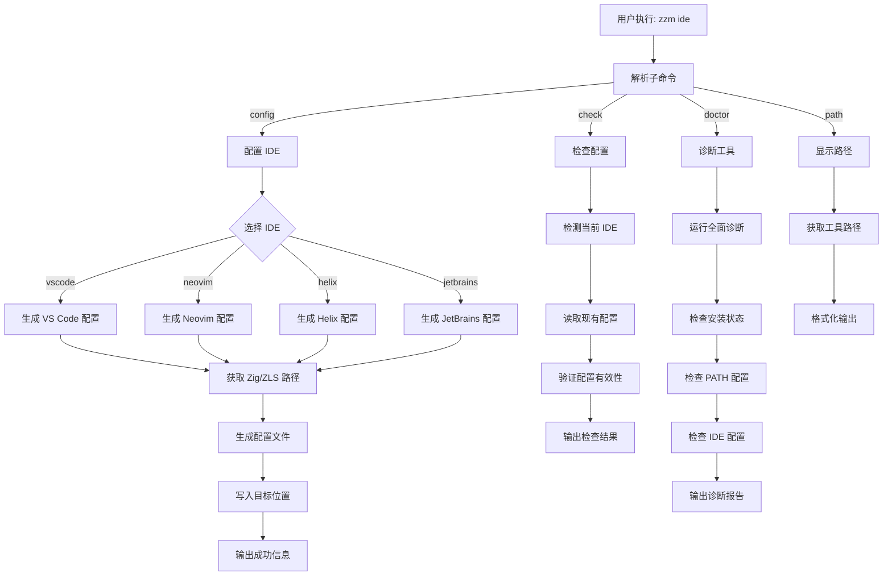
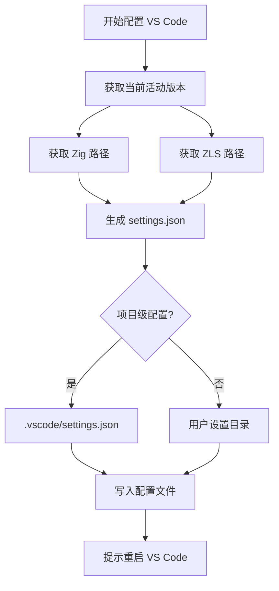
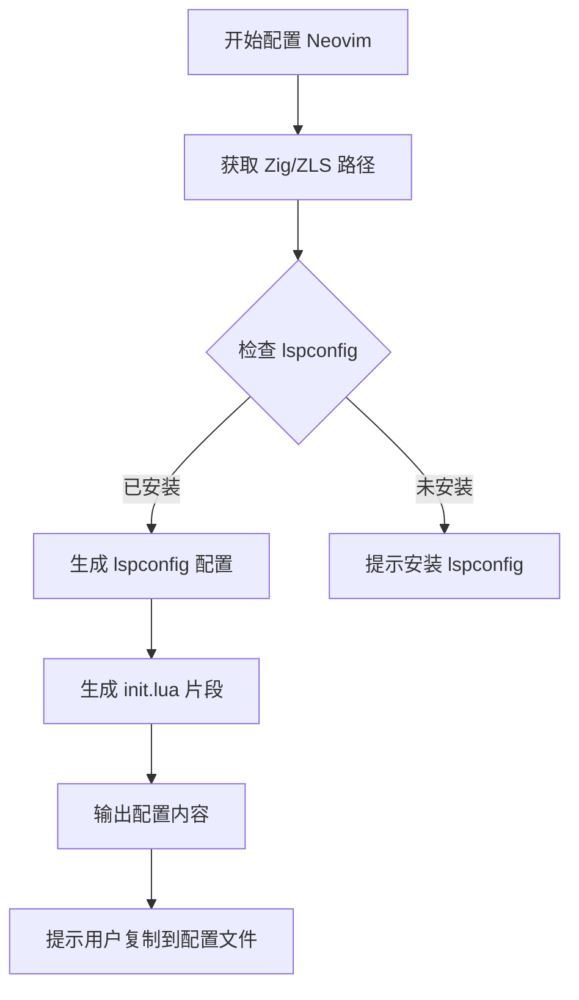
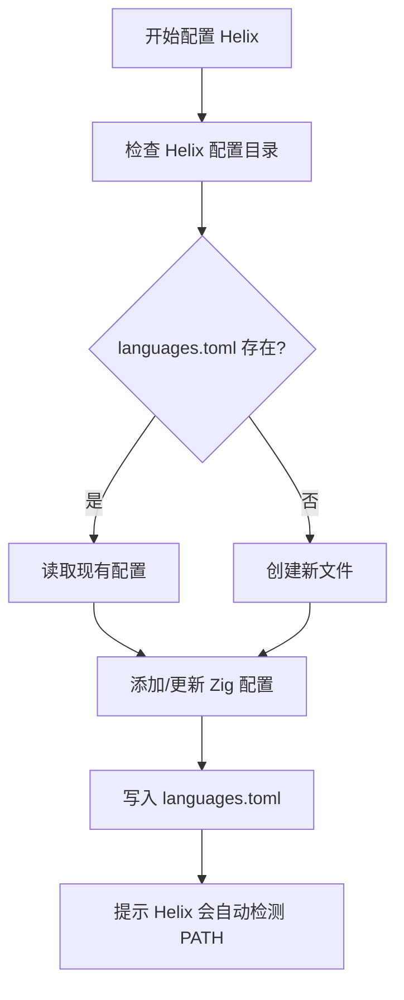
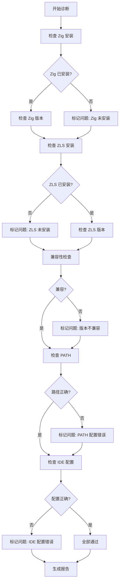
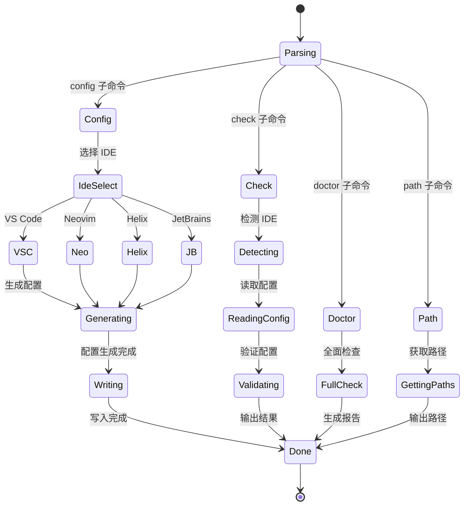

# IDE 集成流程 - Zig/ZLS 版本管理器

## IDE 集成流程总览



## IDE 配置生成子流程

### 2.1 VS Code 配置生成



### 2.2 Neovim 配置生成



### 2.3 Helix 配置生成



## IDE 诊断流程



## IDE 集成状态机



## 配置文件格式示例

### VS Code settings.json

```json
{
  "zig.path": "~/.zzm/bin/zig",
  "zig.zls.path": "~/.zzm/bin/zls",
  "[zig]": {
    "editor.defaultFormatter": "ziglang.vscode-zig",
    "editor.formatOnSave": true
  }
}
```

### Neovim lspconfig

```lua
require('lspconfig').zls.setup({
  cmd = { '~/.zzm/bin/zls' },
  settings = {
    zls = {
      zig_exe_path = '~/.zzm/bin/zig',
      enable_inlay_hints = true,
    }
  }
})
```

### Helix languages.toml

```toml
[language-server.zls]
command = "zls"

[[language]]
name = "zig"
language-servers = ["zls"]
formatter = { command = "zig", args = ["fmt", "--stdin"] }
```