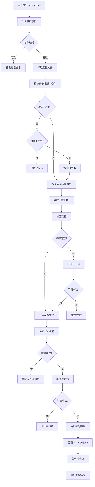
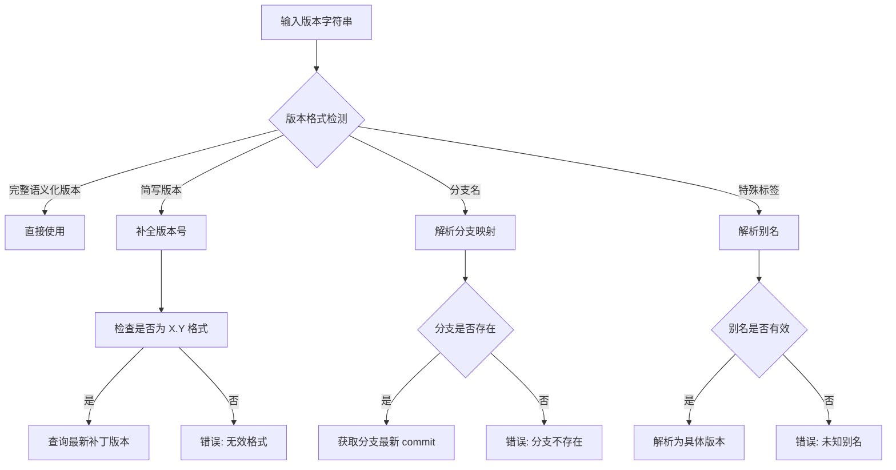
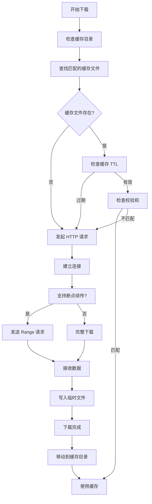
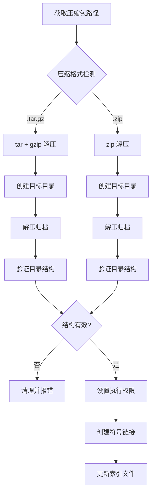
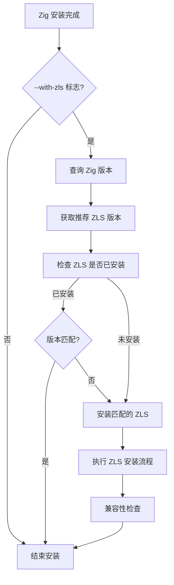
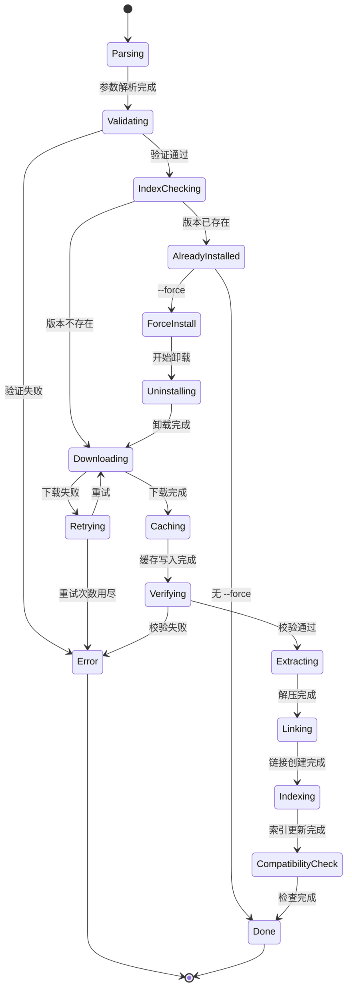

# 安装流程 - Zig/ZLS 版本管理器

## 安装流程总览

```mermaid
flowchart TD
    A[用户执行: zzm install <version>] --> B[CLI 参数解析]
    B --> C{参数验证}
    C -->|无效| D[输出错误提示]
    C -->|有效| E[读取配置文件]
    E --> F[检查已安装版本索引]
    F --> G{版本已安装?}
    G -->|是| H{--force 标志?}
    H -->|否| I[提示已安装]
    H -->|是| J[卸载旧版本]
    G -->|否| K[查询远程版本信息]
    J --> K
    K --> L[获取下载 URL]
    L --> M[检查缓存]
    M --> N{缓存有效?}
    N -->|是| O[使用缓存文件]
    N -->|否| P[HTTP 下载]
    P --> Q{下载成功?}
    Q -->|否| R[重试/失败]
    Q -->|是| O
    O --> S[SHA256 校验]
    S --> T{校验通过?}
    T -->|否| U[删除文件并报错]
    T -->|是| V[解压压缩包]
    V --> W{解压成功?}
    W -->|否| X[清理并报错]
    W -->|是| Y[更新符号链接]
    Y --> Z[更新 installed.json]
    Z --> AA[兼容性检查]
    AA --> AB[输出安装结果]
```

## 安装子流程详解

### 2.1 版本解析与验证

```mermaid
flowchart TD
    A[输入版本字符串] --> B{版本格式检测}
    B -->|完整语义化版本| C[直接使用]
    B -->|简写版本| D[补全版本号]
    B -->|分支名| E[解析分支映射]
    B -->|特殊标签| F[解析别名]
    
    D --> D1[检查是否为 X.Y 格式]
    D1 -->|是| D2[查询最新补丁版本]
    D1 -->|否| D3[错误: 无效格式]
    
    E --> E1{分支是否存在}
    E1 -->|是| E2[获取分支最新 commit]
    E1 -->|否| E3[错误: 分支不存在]
    
    F --> F1{别名是否有效}
    F1 -->|是| F2[解析为具体版本]
    F1 -->|否| F3[错误: 未知别名]
```

### 2.2 下载与缓存机制

```mermaid
flowchart TD
    A[开始下载] --> B[检查缓存目录]
    B --> C[查找匹配的缓存文件]
    C --> D{缓存文件存在?}
    D -->|否| E[发起 HTTP 请求]
    D -->|是| F[检查缓存 TTL]
    F -->|过期| E
    F -->|有效| G[检查校验和]
    G -->|匹配| H[使用缓存]
    G -->|不匹配| E
    
    E --> I[建立连接]
    I --> J[支持断点续传?]
    J -->|是| K[发送 Range 请求]
    J -->|否| L[完整下载]
    K --> M[接收数据]
    L --> M
    M --> N[写入临时文件]
    N --> O[下载完成]
    O --> P[移动到缓存目录]
    P --> H
```

### 2.3 解压与安装

```mermaid
flowchart TD
    A[获取压缩包路径] --> B{压缩格式检测}
    B -->|.tar.gz| C[tar + gzip 解压]
    B -->|.zip| D[zip 解压]
    
    C --> C1[创建目标目录]
    C1 --> C2[解压归档]
    C2 --> C3[验证目录结构]
    
    D --> D1[创建目标目录]
    D1 --> D2[解压归档]
    D2 --> D3[验证目录结构]
    
    C3 --> E{结构有效?}
    D3 --> E
    E -->|否| F[清理并报错]
    E -->|是| G[设置执行权限]
    G --> H[创建符号链接]
    H --> I[更新索引文件]
```

### 2.4 同时安装 ZLS (--with-zls)

```mermaid
flowchart TD
    A[Zig 安装完成] --> B{--with-zls 标志?}
    B -->|否| C[结束安装]
    B -->|是| D[查询 Zig 版本]
    D --> E[获取推荐 ZLS 版本]
    E --> F[检查 ZLS 是否已安装]
    F -->|已安装| G{版本匹配?}
    G -->|是| C
    G -->|否| H[安装匹配的 ZLS]
    F -->|未安装| H
    H --> I[执行 ZLS 安装流程]
    I --> J[兼容性检查]
    J --> C
```

## 安装流程状态机

```mermaid
stateDiagram-v2
    [*] --> Parsing
    Parsing --> Validating : 参数解析完成
    Validating --> IndexChecking : 验证通过
    Validating --> Error : 验证失败
    
    IndexChecking --> AlreadyInstalled : 版本已存在
    IndexChecking --> Downloading : 版本不存在
    
    AlreadyInstalled --> ForceInstall : --force
    AlreadyInstalled --> Done : 无 --force
    
    ForceInstall --> Uninstalling : 开始卸载
    Uninstalling --> Downloading : 卸载完成
    
    Downloading --> Caching : 下载完成
    Downloading --> Retrying : 下载失败
    Retrying --> Downloading : 重试
    Retrying --> Error : 重试次数用尽
    
    Caching --> Verifying : 缓存写入完成
    Verifying --> Extracting : 校验通过
    Verifying --> Error : 校验失败
    
    Extracting --> Linking : 解压完成
    Linking --> Indexing : 链接创建完成
    Indexing --> CompatibilityCheck : 索引更新完成
    CompatibilityCheck --> Done : 检查完成
    
    Error --> [*]
    Done --> [*]
```