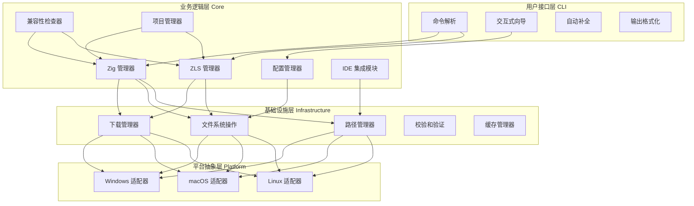
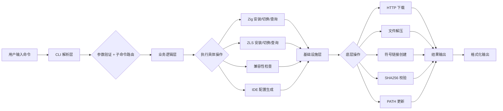
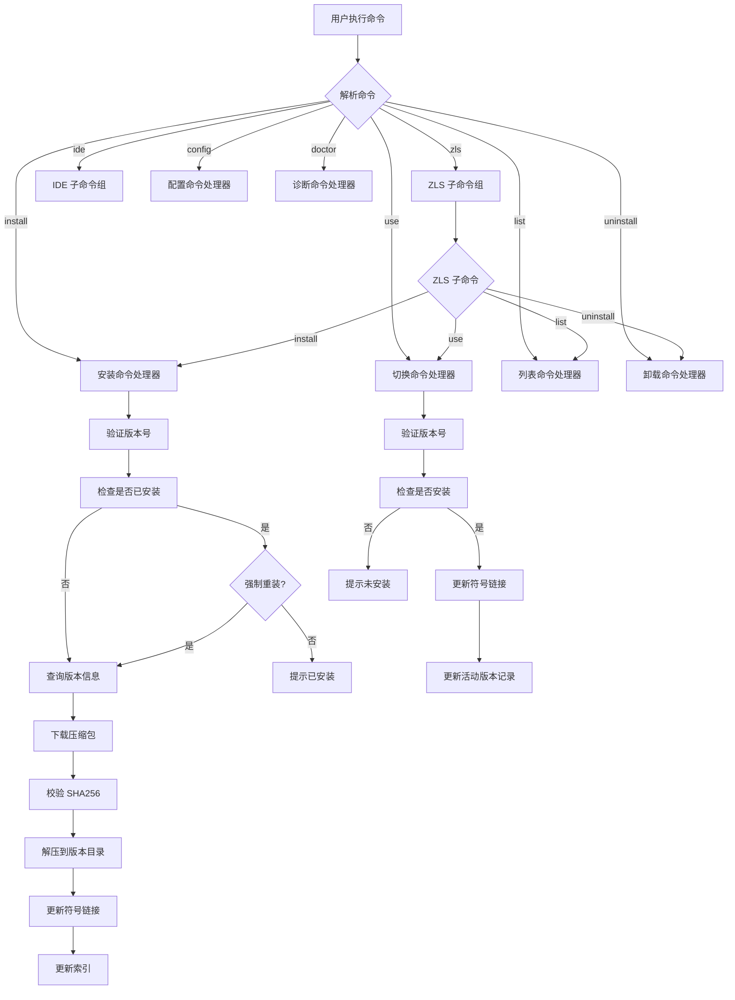

# Zig/ZLS 版本管理器 - 核心业务流程总览

## 系统架构分层

```mermaid
flowchart TD
    subgraph 用户接口层 CLI
        A1[命令解析]
        A2[交互式向导]
        A3[自动补全]
        A4[输出格式化]
    end
    
    subgraph 业务逻辑层 Core
        B1[Zig 管理器]
        B2[ZLS 管理器]
        B3[兼容性检查器]
        B4[配置管理器]
        B5[项目管理器]
        B6[IDE 集成模块]
    end
    
    subgraph 基础设施层 Infrastructure
        C1[下载管理器]
        C2[文件系统操作]
        C3[路径管理器]
        C4[校验和验证]
        C5[缓存管理器]
    end
    
    subgraph 平台抽象层 Platform
        D1[Windows 适配器]
        D2[macOS 适配器]
        D3[Linux 适配器]
    end
    
    A1 --> B1
    A1 --> B2
    A2 --> B4
    B1 --> C1
    B1 --> C2
    B1 --> C3
    B2 --> C1
    B2 --> C2
    B3 --> B1
    B3 --> B2
    B4 --> C2
    B5 --> B1
    B5 --> B2
    B6 --> C3
    C1 --> D1
    C1 --> D2
    C1 --> D3
    C2 --> D1
    C2 --> D2
    C2 --> D3
    C3 --> D1
    C3 --> D2
    C3 --> D3
```

## 核心数据流

```mermaid
flowchart LR
    A[用户输入命令] --> B[CLI 解析层]
    B --> C{参数验证 + 子命令路由}
    C --> D[业务逻辑层]
    D --> E{执行具体操作}
    E --> E1[Zig 安装/切换/查询]
    E --> E2[ZLS 安装/切换/查询]
    E --> E3[兼容性检查]
    E --> E4[IDE 配置生成]
    E1 --> F[基础设施层]
    E2 --> F
    E3 --> F
    E4 --> F
    F --> G{底层操作}
    G --> G1[HTTP 下载]
    G --> G2[文件解压]
    G --> G3[符号链接创建]
    G --> G4[SHA256 校验]
    G --> G5[PATH 更新]
    G1 --> H[结果输出]
    G2 --> H
    G3 --> H
    G4 --> H
    G5 --> H
    H --> I[格式化输出]
```

## 命令路由流程

```mermaid
flowchart TD
    A[用户执行命令] --> B{解析命令}
    B -->|install| C[安装命令处理器]
    B -->|use| D[切换命令处理器]
    B -->|list| E[列表命令处理器]
    B -->|uninstall| F[卸载命令处理器]
    B -->|zls| G[ZLS 子命令组]
    B -->|ide| H[IDE 子命令组]
    B -->|config| I[配置命令处理器]
    B -->|doctor| J[诊断命令处理器]
    
    C --> C1[验证版本号]
    C1 --> C2[检查是否已安装]
    C2 -->|是| C3{强制重装?}
    C2 -->|否| C4[查询版本信息]
    C3 -->|是| C4
    C3 -->|否| C5[提示已安装]
    C4 --> C6[下载压缩包]
    C6 --> C7[校验 SHA256]
    C7 --> C8[解压到版本目录]
    C8 --> C9[更新符号链接]
    C9 --> C10[更新索引]
    
    D --> D1[验证版本号]
    D1 --> D2[检查是否安装]
    D2 -->|是| D3[更新符号链接]
    D2 -->|否| D4[提示未安装]
    D3 --> D5[更新活动版本记录]
    
    G --> G1{ZLS 子命令}
    G1 -->|install| C
    G1 -->|use| D
    G1 -->|list| E
    G1 -->|uninstall| F
```