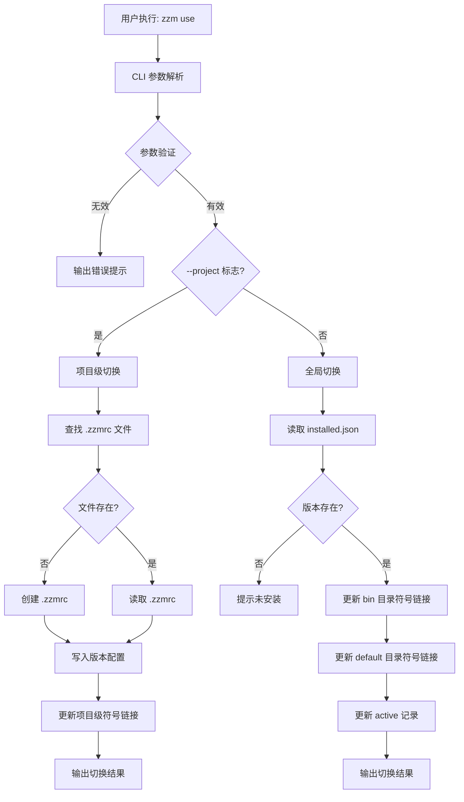
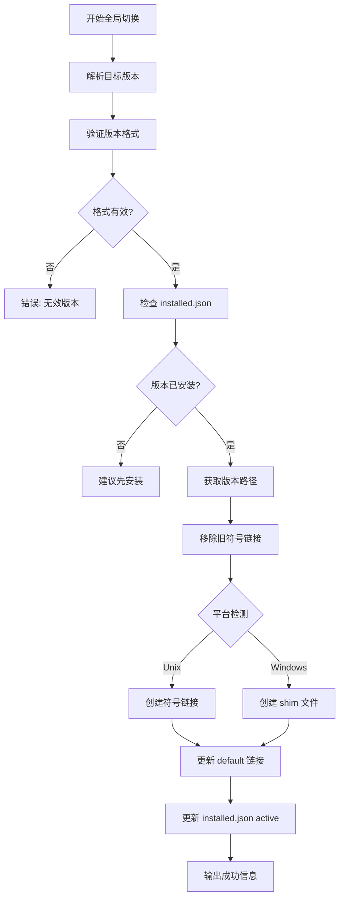
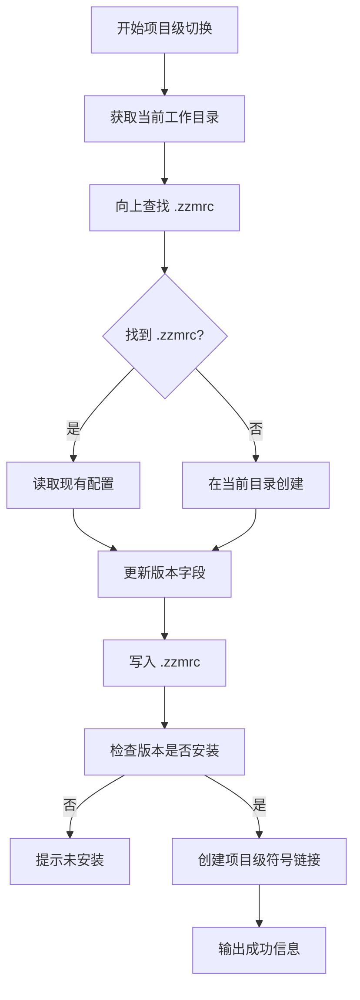
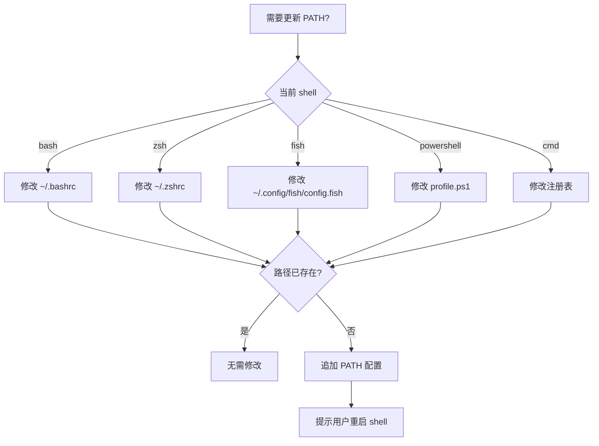
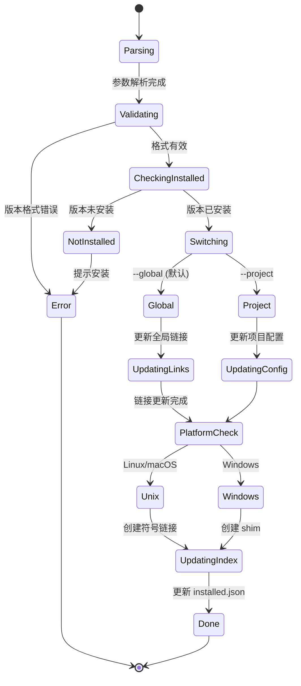
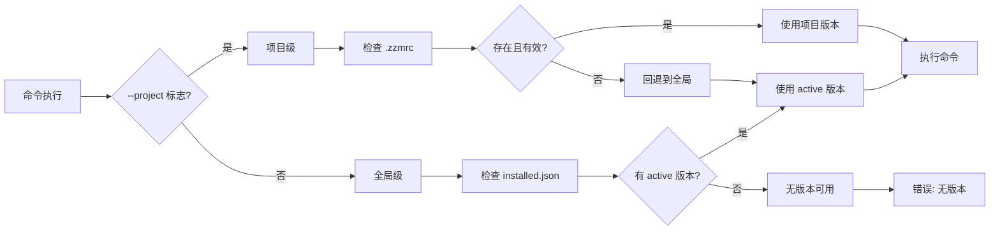

# 版本切换流程 - Zig/ZLS 版本管理器

## 版本切换流程总览

```mermaid
flowchart TD
    A[用户执行: zzm use <version>] --> B[CLI 参数解析]
    B --> C{参数验证}
    C -->|无效| D[输出错误提示]
    C -->|有效| E{--project 标志?}
    E -->|是| F[项目级切换]
    E -->|否| G[全局切换]
    
    G --> H[读取 installed.json]
    H --> I{版本存在?}
    I -->|否| J[提示未安装]
    I -->|是| K[更新 bin 目录符号链接]
    K --> L[更新 default 目录符号链接]
    L --> M[更新 active 记录]
    M --> N[输出切换结果]
    
    F --> O[查找 .zzmrc 文件]
    O --> P{文件存在?}
    P -->|否| Q[创建 .zzmrc]
    P -->|是| R[读取 .zzmrc]
    Q --> S[写入版本配置]
    R --> S
    S --> T[更新项目级符号链接]
    T --> U[输出切换结果]
```

## 版本切换子流程详解

### 2.1 全局切换流程

```mermaid
flowchart TD
    A[开始全局切换] --> B[解析目标版本]
    B --> C[验证版本格式]
    C --> D{格式有效?}
    D -->|否| E[错误: 无效版本]
    D -->|是| F[检查 installed.json]
    F --> G{版本已安装?}
    G -->|否| H[建议先安装]
    G -->|是| I[获取版本路径]
    
    I --> J[移除旧符号链接]
    J --> K{平台检测}
    K -->|Unix| L[创建符号链接]
    K -->|Windows| M[创建 shim 文件]
    
    L --> N[更新 default 链接]
    M --> N
    N --> O[更新 installed.json active]
    O --> P[输出成功信息]
```

### 2.2 项目级切换流程

```mermaid
flowchart TD
    A[开始项目级切换] --> B[获取当前工作目录]
    B --> C[向上查找 .zzmrc]
    C --> D{找到 .zzmrc?}
    D -->|是| E[读取现有配置]
    D -->|否| F[在当前目录创建]
    
    E --> G[更新版本字段]
    F --> G
    G --> H[写入 .zzmrc]
    H --> I[检查版本是否安装]
    I -->|否| J[提示未安装]
    I -->|是| K[创建项目级符号链接]
    K --> L[输出成功信息]
```

### 2.3 PATH 环境变量更新

```mermaid
flowchart TD
    A[需要更新 PATH?] --> B{当前 shell}
    B -->|bash| C[修改 ~/.bashrc]
    B -->|zsh| D[修改 ~/.zshrc]
    B -->|fish| E[修改 ~/.config/fish/config.fish]
    B -->|powershell| F[修改 profile.ps1]
    B -->|cmd| G[修改注册表]
    
    C --> H{路径已存在?}
    D --> H
    E --> H
    F --> H
    G --> H
    
    H -->|是| I[无需修改]
    H -->|否| J[追加 PATH 配置]
    J --> K[提示用户重启 shell]
```

## 版本切换状态机

```mermaid
stateDiagram-v2
    [*] --> Parsing
    Parsing --> Validating : 参数解析完成
    
    Validating --> Error : 版本格式错误
    Validating --> CheckingInstalled : 格式有效
    
    CheckingInstalled --> NotInstalled : 版本未安装
    CheckingInstalled --> Switching : 版本已安装
    
    NotInstalled --> Error : 提示安装
    Switching --> Global : --global (默认)
    Switching --> Project : --project
    
    Global --> UpdatingLinks : 更新全局链接
    Project --> UpdatingConfig : 更新项目配置
    
    UpdatingLinks --> PlatformCheck : 链接更新完成
    UpdatingConfig --> PlatformCheck
    
    PlatformCheck --> Unix : Linux/macOS
    PlatformCheck --> Windows : Windows
    
    Unix --> UpdatingIndex : 创建符号链接
    Windows --> UpdatingIndex : 创建 shim
    
    UpdatingIndex --> Done : 更新 installed.json
    Done --> [*]
    Error --> [*]
```

## 版本优先级解析

```mermaid
flowchart LR
    A[命令执行] --> B{--project 标志?}
    B -->|是| C[项目级]
    B -->|否| D[全局级]
    
    C --> E[检查 .zzmrc]
    E --> F{存在且有效?}
    F -->|是| G[使用项目版本]
    F -->|否| H[回退到全局]
    
    D --> I[检查 installed.json]
    I --> J{有 active 版本?}
    J -->|是| K[使用 active 版本]
    J -->|否| L[无版本可用]
    
    G --> M[执行命令]
    H --> K
    K --> M
    L --> N[错误: 无版本]
```